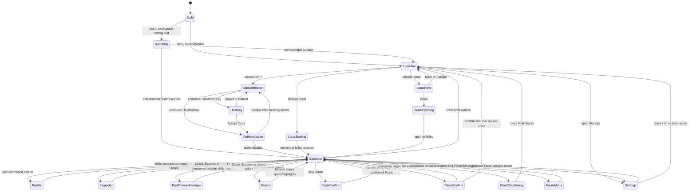

# GUI Exploration and Test Action Graph

**Status:** Normative test-navigation companion to
[`gui-design.md`](gui-design.md)

**Scope:** Every user-observable workflow and state described by the GUI design,
including implemented, partially implemented, deferred, failure, cancellation,
undo, and return-to-known-state paths.

This document turns the GUI design into a traversable action graph. It does not
replace the product rules in `gui-design.md`, the evidence inventory in
`manual-validation.md`, or the test tiers in `ui-test-plan.md`. When wording or
behavior conflicts, `gui-design.md` is authoritative. This graph supplies the
route through those requirements and the recovery path after each probe.

For `LAUNCH-12` and `LAUNCH-20`, periodic discovery must not schedule a GUI
frame when inventory and provider errors are unchanged. Explicit refresh,
generation invalidation, and disabled-work cancellation still apply. Visible
relative-age labels refresh independently at minute scale.
Discovery test synchronization observes retirement of the specific requested
worker, including completion between inspection and update; it must not wait
for the replacement periodic worker in the same generation.

For `SET-07`, unread background output always shows a static ring-and-dot
marker with no animation repaint scheduling. There is no setting, and older
saved pulse booleans are accepted but ignored. Activation clears the marker.
Native CPU and visual evidence is
tracked by `CP-16`.

For Launcher, connection forms, Settings cards, Profiles panels, the chrome
band, status-bar frame, Inspector overlay (`INSP-01..04`), and SFTP pane/table
frames (`SFTPG-01`, `SFTPG-04`, `SFTPG-06`), Windows
DX12 CPU adapters may use the textureless fill pipeline while retaining egui's
layout, rounded geometry, borders and clipping. Hardware and unsupported
surfaces retain standard painting.
Pixel-equivalence and adapter-policy tests accompany CP-16's native evidence;
no discovery, unread-state or command-routing semantics change.
Inspector's transparent outside-click catcher remains ordinary and consumes
the first uncovered click. SFTP headers, filters, rail, rows, transfer drawer,
collision cards, and modal backdrop/shadow remain ordinary controls in this
bounded coverage change. Exact full-widget framebuffer comparisons and
balanced same-executable Windows WARP draw/readback measurements justify these
routes; UI construction has a small measured absolute overhead. This is not
shipping before/after or native presentation-latency evidence, and eligibility
alone does not justify further sites. See `validation/windows-warp/README.md`.

For `PROF-01` and `PROF-06`, the default local persistence provider is detected
once when the composition root creates a window, not by scanning `PATH` on
each Profiles repaint. Existing profiles and explicit provider choices are
unaffected; a new window captures a new default.

The native CPU oracle for these edges and `TERM-01` must identify the real
PID-owned application window, not winit's visible event-target tool window.
Warmup or sample input invalidates a controlled measurement; loss of window
identity, foreground activation or responsiveness fails qualification. Keep
failed samples rather than retrying until green. These are validation guards,
not changes to production scheduling or rendering.

For `TERM-01`, software-rendered terminal backgrounds may use the native
solid-color path, but text, colors, clipping, opacity and input behavior must
remain identical. `CP-17` pairs a native CPU ceiling with a minimum GUI
frame-building rate under controlled output; neither is a production frame
limit or a claim about OS presentation latency.

The Direct2D experiment also affects `TERM-01`: on supported Windows x64 WARP
targets it is the automatic eligible root-terminal path without a setting.
Unsupported-adapter cases stay on ordinary painting without a selection
warning. Input ownership, geometry, clipping, colors and
output consumption remain unchanged. A rejected native frame keeps ordinary
painting in the same frame. CP-18 tracks the remaining
native qualification; ADR-0039 accepts the bounded policy and issue #244 remains open.

For `TERM-01`, ADR 0043 introduces a non-consuming font-image identity and one
immutable per-context snapshot retained only within a 64 MiB ceiling. Capture
after tessellation includes same-frame glyphs; font deltas remain renderer-owned.
Painter teardown/replacement clears the cache and retired batches cannot refill
it. Native texture identity/equal replacement preserves pixels and upload
behavior without changing input, cadence, fallback or backend defaults. CI
explicitly runs the excluded vendored atlas mutation/clone tests as well as the
integrated snapshot/lifetime tests. This accepts neither sustained process CPU
improvement nor native-window/resource/latency qualification; #298 and CP-18
retain those evidence gates.
ADR 0043's accepted disposition covers the source-reviewed snapshot ownership
and vendoring contract only, not acceptance of the broader native renderer.
Vendor mutation tests run on all three desktop platforms; portable repository
hygiene tests reject tracked Cargo build output and protect nested vendor ignores.

`TERM-01` also has a controlled TUI performance corpus: quiet populated content,
localized status updates, streaming primary-screen output, full alternate-screen
redraws, and recorded Copilot/Vim/htop/tmux screens. The optional completed-render
replay checks pixels; the separately opt-in Windows Terminal comparison checks
matched workload delivery, font, grid, native-window identity and CPU. Neither
GUI frame counts nor offscreen timings establish physical presentation latency.
See `validation/terminal-performance/README.md` and CP-18.

Proposed ADR 0044 adds a bounded ordinary monochrome row-paint cache for issue #327.
Exact-mesh tests compare unchanged reuse, dirty content, fonts/DPI, selection
and monochrome Unicode against the cache-disabled renderer. Budget, teardown,
history/resize, clip, opacity, transforms, cursor and native fallback are covered.
Color-emoji and foreign textures are never retained. Redraw clears reuse;
font-image changes also clear glyph layouts before replay, preventing stale
galleys from being stamped with a replacement atlas identity. Atlas-content and
GPU-pixel regressions cover reset without manual invalidation.
Unshaped blank-background groups preserve exact instruction order; full-row
mutation bypasses retention with shaping both on and off, then returns to
caching when content stabilizes. Native painting, transforms, opacity and emoji retain ordinary paths. This
changes neither event-driven scheduling nor the terminal/session writer.
Issue #334's bounded cleanup shares one revision token per nonempty presentation
update, comparing identities only at the same row position. Capture bookmarks
are created only for eligible retained rows. Batch/clone/independent-cache
identity, swapped-row exact meshes and zero full-mutation bookmarks are covered;
52 isolated unlocked native runs at `86e4274` complete CPU requalification.
The opt-in `profile_retained_grid_row_stages` measures CPU-stage cost, not GPU
presentation. Cleanup controls against the original baseline retain 13-23%
localized/Unicode savings, approximately neutral unshaped full foreground and
0.133% quiet CPU in both shaping modes. Longer shaped full foreground remains
+2.56%, adverse in all four pairs; the owner explicitly accepts this bounded
tradeoff for #328 while #334 remains open. Historical matrices and low-first-run
outliers remain preserved, with no established cause or causal before/after
speedup claim. External PR review remains required; CP-18, native input,
mixed-DPI and physical latency are not advanced by these CPU measurements.

The optional residual-CPU probe separates frozen full-application composition
from terminal preparation/drawing using completed GPU work and process-wide CPU
time. Its diagnostic mesh omissions are not valid production optimizations.
The chrome fill optimization must preserve every pixel, including fractional
DPI, clipping and translucent fallback, without changing update cadence.
`PAL-01`/`PAL-03`/`PAL-04` additionally retain exact palette frame/shadow and
opaque untextured search/selection-rectangle pixels
when eligible WARP uses the same geometry through the textureless panel shader.
Sixteen theme/height/query/DPI combinations and five fallback cases are
automated and assert real frame/fill conversion; textured/translucent candidates,
renderer reinstallation and missing-renderer fallback are covered.
Unsupported roots, transforms/viewports/adapters/formats keep ordinary painting.
This changes neither widget geometry/focus nor final-terminal copy eligibility;
native appearance, resource and presentation evidence remains under CP-18.

The owner-approved automatic host-copy and retained window-prefix policies
under ADRs 0040/0041 select both only
on Windows x64 DX12 CPU/BGRA gamma and compatible opaque-root targets.
All three production renderer/composition switches are retired and ignored.
Only exact, bounded, immutable paint signatures may reuse preceding UI pixels;
the current terminal image is still copied every frame. Texture changes,
unknown/stateful callbacks, external texture ownership, overlays and host
lifecycle changes must invalidate or decline retention without skipping
preparation or output. CP-18 compares host-copy alone against this additional
path and the shipping shader baseline, requiring actual reuse/copy counters,
current pixels and unchanged cadence. Rollout accepts the repeatable practical
CPU benefit despite shared-host noise, not precise benchmark percentages,
physical presentation latency or multi-day CPU-cause attribution.
The repository-owned balanced offscreen runner checks cross-run evidence without
making CPU percentages CI assertions. Off/on controls exist only in test probes;
native A/B/C campaigns require their historical driver/binary. Remaining
native/resource/latency follow-ups are explicit in
[#282](https://github.com/fes/fesTerm/issues/282).

The supported native path now retains immutable pixels for unchanged
presentation regions. Small updates redraw only changed regions before normal
egui-wgpu composition. Session pumping does not request an extra repaint for
output already displayed by the current frame; bounded-drain continuation and
background unread state remain independent. Pending resize deadlines re-arm
an early repaint until the debounced resize can be sent, without an idle poll.
Session availability uses egui's single-pass wake API rather than its zero-delay
two-pass widget-settling policy. Every event still requests a wake, including
events arriving during a frame; no output/frame-rate budget is introduced.

For `KEY-01/02`, `CHIP-01` and `SET-05`, frame-time binding reads borrow live
application preferences instead of reconstructing persistable interface settings
for every chip or input/menu check. Local edits and `WINDOW-02` committed
broadcasts take effect immediately; settings persistence, input ordering,
session pumping and unread-state semantics are unchanged. Counted one/six-session
synthetic tests prove the avoided snapshots, not native CPU improvement or
attribution of #297.

`TERM-01` now also has an opt-in, owned six-session aging discriminator.
Fresh, bounded tab/DPI/zoom churn and rebuilt GUI states use the same normalized
pixels, workload, physical size and measurement DPI. Paced non-idle phases
measure completed offscreen work; only the idle phase follows actual egui demand.
Native updated/surface pixels, repaint callbacks, completed process CPU,
retained-prefix/atlas counters and sampled process resources are kept distinct.
Public wgpu registry checkpoints and separate renderer/context teardown
observations distinguish retained handles from process residency; vacant slots
are not in-flight allocations and these counters are not total GPU bytes.
Additive short whole-owner rounds drop even the reporting instance before
held resource windows. OS-maintained lifetime commitment peaks and a final
supervisor sample preserve transient commitment missed by 500ms observations;
they are not per-phase peaks. Device-free regressions guard six-session backlog
retirement and stale clipboard completion/cancellation across generations.
Current cache sizes, temporary CPU oracle arrays and completed host submissions
stay distinct from unmeasured driver-private/queued/in-flight bytes.
`FrameDiagnostics.dirty_rows` is UI-cache work, not GPU damage. No notifier,
production cadence, terminal ownership or queue policy changes are involved.
This is not a multi-day reproducer, real persistent-shell reconnect, native
presentation measurement or attribution of WARP worker threads; #297 and
CP-18 remain open. See the performance validation guide.

For `TERM-01`, presentation cell copies keep common text inline and reuse
dirty-row/same-dimension viewport backing. Dimension changes retire old row
capacity; long-to-short replacements release heap text. Unicode, style,
hyperlinks, width-two continuations, selection, shaping runs and dirty-row
revision semantics remain unchanged. A CPU-only system-allocator oracle
measures this copy stage separately from painted-row reuse, native GPU work,
process residency and frame time.

For `TYPE-01` and `TERM-01`, the glyph-layout cache retains its 4,096-entry
bound but retires only the least-recently-used entry on a capacity-crossing
miss. Indexed recency touches do not scan arrays or copy keys; font/atlas and
manual resets still invalidate every affected layout. Collision-safe recorded
hash/slot identity and bounded slot reuse are automated cache-work checks.
The extra bounded metadata and fuller warm-cache retention are intentional;
these tests do not assert lower total memory, native CPU or CP-18 acceptance.

For `TERM-01`, accepted ADR 0045 moves backend-owned atlas admission before
pixel capture, after tessellation includes same-frame glyph growth. Refusal
preserves ordinary shapes, retires only the current painter's snapshot and
retains observable unsupported-frame recovery. Hook revalidation prevents a
retired admission callback from acquiring or clearing replacement state.
Native texture limits and eligible zero-retention controls are unchanged;
CP-18 native resource/presentation/latency qualification remains open.

## How to use the graph

### Isolated iOS feasibility host

These edges belong only to `app/festerm-mobile` (ADR 0042), not the desktop
application or a supported mobile SSH workflow. Checkpoint: newly launched
preview with repository-owned fixtures; Reset restores terminal content.
The iOS workflow's nightly/manual isolated Simulator smoke automates install,
launch survival, first UI callback, terminate/relaunch and PNG capture for
`MOB-01`/`MOB-03`.
A live process without the UI callback fails; app stderr is retained. Screenshots still
require visual review; it does not qualify gestures or background/resume.
Read-only cold-service preparation (#303) runs before compilation under a
pinned toolchain. Its `prepared` receipt is not a passed `MOB-01`/`MOB-03`
application run; inventory, launch/capture and cleanup checks remain unchanged.
Affected PRs retain mobile unit/dependency checks, device compilation and
Simulator app builds, including vendor-only epaint edits; they skip
CoreSimulator preparation and runtime smoke while iOS is experimental.
Nightly/manual failures retain their failed status and artifacts (#303), not
desktop merge vetoes; their `experimental-simulator-smoke` check is distinct
from the PR's `simulator-build` context. Workflow-policy and preparation/non-app-evidence
regressions are named in ADR 0042. Native feasibility gates remain open;
review an explicit runtime merge gate when mobile product support is accepted.
The mobile device descriptor requests downlevel GPU limits to accommodate the
observed Simulator Metal limit; issue #261 remains the native startup gate.

| ID | From → To | Action / guard | Oracle | Return | Layer |
| --- | --- | --- | --- | --- | --- |
| `MOB-01` | Cold → fixture | Launch, rotate/resize, select and scroll | Shared ANSI/Unicode grid paints within available area; bounded history remains readable | Reset fixture or relaunch | H, V, N, U |
| `MOB-02` | Fixture → input probe | Use docked Esc/Tab/Ctrl/Alt, long-press/drag arrows, native IME or hardware keyboard | Persistent keyboard request on iPhone/iPad without repeated IME interruption on idle frames, accessory taps or terminal keys; grid above measured keyboard; one-shot modifiers; temporary direction helper with neutral zone and three repeat speeds; release/cancellation stops repeats without mouse-report leakage; encoded byte count changes with no duplicate text, execution or retained text | Reset fixture | P, H, N |
| `MOB-03` | Active → suspended → active | Background/foreground, memory warning, terminate/relaunch | No suspended redraw; resume repaints; memory warning preserves grid and text size; process death restarts fixture honestly | Relaunch | P, N |
| `MOB-04` | Fixture → pinching → fixture | Pinch two terminal contacts; take over an arrow hold; reverse at limits; lift/cancel/rotate | Terminal-only zoom uses shared bounds; one coalesced scale per frame; keyboard/chrome unchanged; no arrow or mouse-report leakage; remaining contacts stay captured; an existing ordinary drag retains ownership | Lift all fingers; Reset fixture | P, H, N, U |
| `MOB-05` | Terminal ↔ Files ↔ README | Switch fixed preview categories; select both Files panes, transfer/collide; toggle Markdown Preview/Source/Contents and activate a heading; resize across tiers | Only Terminal requests persistent keyboard/gesture ownership; state survives switching; Files uses Wide horizontal, Compact Remote-top/Local-bottom and Minimal focused-pane layouts with upload moving up, download moving down and bounded synthetic transfer state; Markdown wraps and exposes navigable contents; every workflow remains prominently offline and synthetic | Select Terminal or relaunch | P, H, V, U |

Each test run starts at a named checkpoint, follows one or more edges, asserts
the edge oracle, and returns through the named recovery edge. Never depend on
the state left by an unrelated test. A driver may skip an edge only when its
capability guard is false; it records **not run: capability unavailable**, not
pass.

Edge records use this shape:

| Field | Meaning |
| --- | --- |
| ID | Stable identifier for automation, evidence, and defect reports. |
| From → To | Source and expected destination nodes. |
| Action / guard | User action and required capability or state. |
| Oracle | User-visible, semantic, terminal-grid, transport, privacy, or persistence result. |
| Return | Explicit cancel, undo, close, reset, or checkpoint-rebuild edge. |
| Layer | `P` pure/state, `H` headless UI, `V` visual, `N` native desktop, `U` human usability. |

Run an edge through every applicable invocation route. For example, “Close
session” is one semantic edge exercised from the chip close control, chip
context menu, shortcut, command palette, native menu, and failure overlay. A
route must not grow its own policy.

## Known-state checkpoints

Fixtures use repository-owned identities and content. They contain no personal
clipboard data, shell profile, credentials, host, path, or terminal history.

| Node | Known state and construction | Required cleanup |
| --- | --- | --- |
| `K0 Cold` | No fesTerm process; isolated empty configuration and workspace. | Remove disposable configuration and evidence directory. |
| `K1 LauncherOnly` | One focused Launcher chip, no session, empty footer content, default preferences. | Close extra surfaces; if necessary restart from `K0`. |
| `K2 LiveLocal` | One controlled local test-child session, running, focused, at live bottom, no selection/modal/overlay. | Bounded shutdown, then return to `K1`. |
| `K3 MultiSurface` | Live local A active, live local B inactive, singleton Launcher and Settings present, single-row chips. | Close Settings/Launcher immediately; confirm-close B then A; reach `K1`. |
| `K4 MouseTui` | Controlled live session with alternate screen and terminal mouse reporting active. | Send fixture exit sequence; verify primary buffer; return `K2`. |
| `K5 HistoryLive` | Controlled live session with bounded retained primary-screen history, viewport at bottom. | `Ctrl+End`, clear selection/search, then bounded close to `K1`. |
| `K6 HistoryReadOnly` | Exited/disconnected session with retained history and no accepted input. | Close immediately; return to `K1`. |
| `K7 SshUnknownHost` | Disposable SSH fixture waiting on an unknown host-key decision. | Reject/cancel; clear fixture trust state; return to destination or `K1`. |
| `K8 SshAuth` | Fixture host accepted for this attempt; password authentication surface focused and empty. | Clear password, cancel attempt, return to destination then `K1`. |
| `K9 LiveSsh` | Connected disposable SSH fixture with known non-secret inspector facts. | Disconnect preserving history, then close to `K1`. |
| `K10 RestoreMixed` | Workspace recipe with one successful local definition, one SSH auth-required definition, and one invalid/missing definition. | Close restored surfaces and remove disposable workspace; return `K1`. |
| `K11 Narrow` | Any applicable checkpoint at `360 × 516` logical px and recorded scale; dialog/palette geometry also exercises the supported `360 × 240` short root with complete disclosures and reachable actions. | Restore `752 × 516` baseline. |
| `K12 Modal` | A specified close/paste/trust/destructive dialog open with Cancel focused. | Take its safe Cancel/Escape edge, verify zero unintended bytes/effects. |
| `K13 Serial` | Serial fixture: Linux `crates/festerm-serial/tests/socat_loopback.rs` virtual loopback, or a representative hardware adapter on macOS/Windows per `docs/native-smoke-policy.md`. | Close/release port, remove loopback or disconnect the hardware fixture, return `K1`. |
| `K14 ChangedHostKey` | Disposable SSH fixture whose persisted trust record names a different fingerprint than the one currently presented. | Cancel; restore fixture trust store to its prior single-record state; return to destination or `K1`. |

Every unexpected state has a bounded recovery ladder:

```text
cancel transient field/menu/overlay
  -> close non-session surfaces
  -> stop/disconnect live transport while preserving history when supported
  -> confirm-close remaining sessions
  -> LauncherOnly
  -> bounded app shutdown
  -> Cold
```

If a step cannot complete within its watchdog, capture sanitized state and use
bounded backend/application shutdown. Do not continue the graph from an
uncertain state.

## Global state graph



## A. Root, Launcher, and surface lifecycle

| ID | From → To | Action / guard | Oracle | Return | Layer |
| --- | --- | --- | --- | --- | --- |
| `ROOT-01` | `K0 → K1` | Start with no workspace. | Exactly one ordinary Launcher; no wizard, promotion, telemetry prompt, disabled future transport, or blank root. Local is initially highlighted; footer footprint is stable and empty. | `ROOT-02` or quit to `K0`. | H,V,N,U |
| `ROOT-02` | `K1 → K1` | Try to close the only Launcher. | Window remains defined as Launcher; no empty content and no accidental process exit. | Already `K1`. | P,H,N |
| `ROOT-03` | `K2 → K3` | New Session by chrome, shortcut, palette, and native menu where applicable. | One singleton Launcher is created/focused at row end; active terminal remains alive and unchanged. Repeating does not duplicate it. | `ROOT-04`. | P,H,N |
| `ROOT-04` | `K3 → K2` | Escape or close the Launcher opened beside a session. | Launcher closes immediately and focus returns to the prior terminal; no terminal Escape byte. | Reopen with `ROOT-03`. | H,N |
| `ROOT-05` | `K1 → K2` or `K1 → LocalForm → K2` | Choose Local Shell by click or keyboard. With **Customize local shell before launch** disabled, launch immediately; with it enabled, optionally edit the focused form and press Start or Enter in its final field. | The default path starts the configured platform shell in the user's home directory and converts the Launcher chip in place to Starting then Running. The opt-in form defaults to that shell, offers bounded executable/directory completion, starts from keyboard or button, and dispatches typed `StartLocalSessionWithProfile`; both paths preserve position/identity with no spent Launcher. | With customization enabled, Back/Escape before Start; otherwise `CLOSE-01` then `CLOSE-04`. | P,H,N |
| `ROOT-06` | `K2 → K3` | Start Local Shell directly from the palette or its platform shortcut while a terminal is active. | A new session chip is added; active session is not replaced. | Close new session through `CLOSE-01`. | P,H,N |
| `ROOT-07` | Any nonempty state → same root class | Close the final session while Settings remains. | Settings survives and is active; no forced Launcher duplicate. | Close Settings to reach `K1`. | P,H |
| `ROOT-08` | Any last surface → `K1` | Close final Settings, Launcher, failed, exited, or disconnected surface. | Window returns to Launcher rather than blank or quit. | Already `K1`. | P,H,N |
| `ROOT-09` | Two independent processes | Launch second fesTerm instance. | Separate windows own independent sessions; no detach, cross-window drag, migration, or shared live lifecycle. Fixed native title is `fesTerm`. | Close second instance, verify first unchanged. | N,U |

## B. Launcher choices and connection forms

| ID | From → To | Action / guard | Oracle | Return | Layer |
| --- | --- | --- | --- | --- | --- |
| `LAUNCH-01` | `K1 → K1/LocalForm` | Traverse the top launch-card row by keyboard and resize it through wide and narrow widths. | One row of launch cards for Local Shell, SSH, SFTP, Serial, and Markdown wraps to fewer columns as needed; the highlighted entry follows logical order, Local starts highlighted, cards expose semantic icons, title, description in roomy mode, and proceed affordance. Activating Local opens its executable/arguments/working-directory form; activating Markdown dispatches `AppCommand::OpenMarkdownWorkspace`; activating SSH/SFTP/Serial opens their in-tab forms rather than an `AppCommand`. | Back/Escape from LocalForm, return highlight to Local with Up/Home, or rebuild `K1`. | H,V,N,U |
| `LAUNCH-02` | `K1 → SshDestination` | Activate the SSH launch card. | The remote terminal matches Local's optical size; its accent globe retains two parallels and a meridian with proportional strokes at card and profile-row sizes. The SSH launcher opens on the single `user@host[:port]` notation with initial focus on that field, and a heading toggle switches to the separate Username, Host, then Port fields and back, carrying the destination across and moving focus onto whichever field now leads; exactly one notation is visible at a time. The SSH launcher, SFTP launcher and Profiles SSH/SFTP editor render the same destination pane. Both surfaces share the same initially-off durable-session control. Advanced launch accepts at most 128 validated local/remote port forwards and attaches them to the initial session; excess mappings refuse before connection without truncating the draft. No dimensions, TERM, or unsupported auth controls. | `LAUNCH-03`. | H,V,N,U |
| `LAUNCH-03` | `SshDestination → K1` | Back or Escape before connect. | No session is created; non-secret draft fields are discarded only when Launcher lifetime ends. | `LAUNCH-02`. | H,N |
| `LAUNCH-04` | `SshDestination → same` | Continue with missing/invalid host, username, port, or an over-budget initial forward list. | Destination validation stays beside its field; the forwarding count error states the 128-mapping ceiling and preserves the draft. No network attempt or modal error. | Correct the field/list or `LAUNCH-03`. | P,H,N |
| `LAUNCH-05` | `SshDestination → K7/K8` | Continue with valid fixture destination. | Work is asynchronous; unknown key goes to Host Key before credentials, known key goes to Authentication. `AppCommand::StartSshSession` carries the validated destination, authentication, and session options. | Reject/cancel through `TRUST-02` or `AUTH-03`. | P,H,N |
| `LAUNCH-06` | `K1 → SerialForm` | Activate the Serial launch card. | Same Launcher chip shows device and supported line settings with 115200/8/N/1/no-flow defaults; exact identifier remains visible. A valid Open dispatches `AppCommand::StartSerialSession`. | `SERIAL-02`. | H,V,N,U |
| `LAUNCH-07` | `K1 → PopulatedLauncher` | Provide real saved profiles and inspect the Saved Profiles panel. | The Saved Profiles and Running Sessions headings share one line, and the search text sits on it. The panel has search and sort controls, left-aligned Name/Type/Host / Path/Last Used headers, one 41 px row per profile, and no duplicate SSH/SFTP rows for one saved profile. Activating a row dispatches the profile's matching `AppCommand::StartConfiguredLocalProfile`, `StartConfiguredSshProfile`, `StartConfiguredSftpProfile`, or `StartConfiguredSerialProfile` using a validated snapshot. An SSH profile exceeding 128 forwards visibly refuses before connecting, including stored-credential and direct credential-free paths, without truncating or invalidating the saved configuration. Duplicate visible names receive no fabricated suffix. | Close or launch, then rebuild `K1`. | P,H,V,U; partial |
| `LAUNCH-08` | `SshDestination → K7/K8` | Enable a durable remote session in Quick Connect, Advanced Connect, or a saved SSH profile; select tmux/screen and enter a session name. | The shared control accepts only a 1-64 byte safe name; launch attaches or creates that provider session. When persisted host trust plus a non-interactive credential let fesTerm run a best-effort remote tmux probe before launch, a newly enabled untouched draft defaults to `tmux` if detected and GNU Screen otherwise, but never overwrites an explicit provider choice. Automatic recovery is offered only while persistence is enabled and remains an explicit per-launch opt-in. Disabling persistence returns to plain-shell semantics without erasing the draft name. | Disconnect, then Resume for durable state; disable and reconnect for a fresh plain shell. | P,H,N,U; partial |
| `LAUNCH-09` | `K1 → SshDestination/GuiSftpAuth` | Activate the SFTP launch card. | The SFTP destination form reuses SSH destination validation and defaults to the graphical file manager; clearing **Use graphical file manager** launches the terminal file-transfer session. Saved SFTP profiles preserve this choice and GUI mode now follows the same host-trust ordering as SSH/text SFTP instead of requiring a pre-seeded trust record. Terminal launches dispatch `AppCommand::StartSftpSession`; GUI launches dispatch `AppCommand::OpenSftpFileManager` or follow through the GUI SFTP authentication commands. | Back/Escape to `K1`, continue through `SSH-09`, or continue through `SFTPG-01`. | P,H,N,U; partial |
| `LAUNCH-10` | `K1/K9/Inspector → GuiSftpAuth` | Activate graphical SFTP from a saved SFTP/SSH profile, the command palette, or Session Inspector. | GUI SFTP opens as its own application surface with separate close lifecycle from any shell tab, preserving Local/Remote wording even when visual pane order later swaps. Current known-host trust is resolved from configuration when the surface opens; if the host is new or changed, the launch pauses on the same trust/changed-key prompt rules used by SSH before credentials continue. Saved profiles dispatch `AppCommand::OpenConfiguredSftpFileManagerProfile` before using their opaque native-store password/private-key reference or entering a fresh credential. | Cancel back to the prior surface or continue through `SFTPG-01`. | P,H,N,U; partial |
| `LAUNCH-11` | `AnySurface → LocalFileSelection/same` | Open **Open File…** from More actions or press `Ctrl+O`/`Cmd+O` from any surface *other than a focused terminal*, then either cancel/Escape the picker or choose a regular file. | The picker reuses the SFTP file manager's local-directory browsing widget (breadcrumbs, up/home/refresh navigation, sortable columns, item icons) instead of an OS-native file dialog; every regular file can be selected because extensionless and unfamiliar names may still be text, while folders navigate. Binary or bounded-load failures are reported by the document loader. Entering a folder starts at the top; Back, Up, and ancestor breadcrumbs restore scroll only while retracing the active stack, and popped folders start at the top if entered again. Its filter remains active across folders. It opens in the directory the previous picker was browsing, or the user's home directory the first time; Home resolves through `HOME` then `USERPROFILE`, so it is the real home folder on Windows as well as Unix. The picker's filter field, breadcrumbs, column headers and rows all span the same width, and the filter field's glyph and text are centred in its box. On Windows and Linux a focused terminal keeps plain `Ctrl+O` for the program running inside it, so the chord is delivered as `0x0F` and the picker does not open; **More actions ▸ Open File…** stays available there. macOS is unaffected because `Cmd+O` is not a terminal control chord. Cancel/Escape leaves the prior surface untouched. A successful Markdown pick opens or focuses the shared local text-editor document in Preview mode and continues through `MD-02`/`EDIT-18`; other text starts in Edit. An already-open document keeps its unsaved buffer and view identity. `AppCommand::OpenMarkdownWorkspace` is the legacy command name that opens the shared picker; the selected path dispatches the appropriate local editor command. No workspace/session/transcript state is created. | Cancel the picker or close the editor to restore the prior surface/`K1`. | P,H,N,U |
| `LAUNCH-12` | `K1 → K1/session` | Enable "Resume unattached local sessions from New Session" (`SET-08`), inspect Running Sessions, Refresh, and Reattach during local provider churn. | Groups are **fesTerm Native (sessiond)**, **tmux**, and **screen**, with deterministic namespaced identities, disclosure headers and eligible-entry counts. Native attached sessions are excluded; tmux/screen attached sessions remain annotated because simultaneous clients are supported. Empty groups are omitted. `AppCommand::RefreshRunningSessions` requests bounded, coalesced background discovery, also refreshed periodically while enabled; disabled/superseded work cannot restore stale rows. Reattach commands carry selected generations and attach only, preserving process/state rather than saved profiles' attach-or-create policy. A vanished/replaced selection or startup failure remains on Launcher with actionable diagnostics and refreshes inventory, without a replacement shell/error-only tab. Missing providers/no server are ordinary absence; other provider failures/timeouts are explicit. Offscreen rows avoid widget/text layout. | Refresh, toggle `SET-08` off, or rebuild `K1`; successful attachment closes/detaches through the ordinary session lifecycle. | P,H,N,U; partial |
| `LAUNCH-13` | `PopulatedLauncher → PopulatedLauncher` | Type in **Search profiles…**. | The Saved Profiles table filters by profile name, type, or host/path without dispatching an `AppCommand`; empty search shows all rows, and no matches shows the panel's empty-search message. | Clear the field or rebuild `K1`. | H,U; deferred |
| `LAUNCH-14` | `PopulatedLauncher → PopulatedLauncher` | Activate the sort-order toggle. | The toggle switches `LauncherState` between **Sorted by last used** and **Sorted by name** without dispatching an `AppCommand`. Recently-used order is the default: launched profiles sort newest first, never-launched profiles sort afterward by name, and the Last Used column shows `Never` or a coarse relative age. | Toggle back or rebuild `K1`. | P,H,U; deferred |
| `LAUNCH-15` | `PopulatedLauncher → launching profile` | Open a saved-profile row menu from the `⋮` overflow control or by right-clicking the row, then choose **Connect**. | Both gestures open the same menu. Connect dispatches the same command as row activation: `AppCommand::StartConfiguredLocalProfile`, `StartConfiguredSshProfile`, `StartConfiguredSftpProfile`, or `StartConfiguredSerialProfile` for the selected profile kind. | Close the launched surface or rebuild `K1`. | P,H,N |
| `LAUNCH-16` | `PopulatedLauncher → launching crossover profile` | Open an SSH or SFTP saved-profile row menu and choose the protocol crossover entry. | SSH-profile menus include **Connect SFTP** and dispatch `AppCommand::StartConfiguredSftpProfile`; SFTP-profile menus include **Connect SSH** and dispatch `AppCommand::StartConfiguredSshProfile`. Local and serial profiles omit the crossover entry rather than disabling it. | Close the launched surface or rebuild `K1`. | P,H,N |
| `LAUNCH-17` | `PopulatedLauncher → Profiles` | Open a saved-profile row menu and choose **Edit**. | The old per-card edit icon is absent. Edit dispatches `AppCommand::OpenProfileEditor` with the selected profile identifier and focuses the singleton Profiles surface in that editor. | Close Profiles or return through profile-editor recovery. | P,H,N |
| `LAUNCH-18` | `PopulatedLauncher → Profiles` | Activate **Manage Profiles…** or **New Profile** from the Saved Profiles footer. | Manage Profiles dispatches `AppCommand::OpenProfiles`. New Profile opens a kind menu; Local Shell, SSH, SFTP, and Serial entries dispatch `AppCommand::CreateProfile` with the chosen `NewProfileKind` rather than duplicating Manage Profiles. | Close Profiles or cancel the menu to return to `K1`. | P,H,N |
| `LAUNCH-19` | `RunningSessions → RunningSessions` | Activate a provider group's disclosure header. | The group toggles its expanded/collapsed `LauncherState` flag, changes between `SectionExpanded` and `SectionCollapsed`, and preserves the provider count without dispatching an `AppCommand`. | Toggle back or rebuild `K1`. | H,V,U; deferred |
| `LAUNCH-20` | `RunningSessions → RunningSessions` | Activate the Running Sessions **Refresh** control, including rapid repeated requests. | `AppCommand::RefreshRunningSessions` invalidates the old discovery generation and coalesces work into at most one active worker plus one pending request. Provider I/O never runs during rendering. Disabled/superseded results are discarded; saved profiles/session definitions remain unchanged. | Already on Launcher; provider failures offer actionable retry diagnostics. | P,H,N |
| `LAUNCH-21` | `PopulatedLauncher → PopulatedLauncher` | Open New Session at a width that keeps both panels side by side with more saved profiles or running sessions than fit their panel. | The launch card row and both panel footers keep their positions; the profile table and the session groups scroll inside their own panels rather than scrolling the whole surface. The surface stays inset from the window's content edge. The tighter layout keeps headings/search aligned and icon actions at least 24 px across; all five card titles fit without elision in a 1000 px window in both density modes. Below the stacking width the surface scrolls as one, because neither panel then has a bounded height to scroll inside. | Already on Launcher. | P,H,N |

## C. Local session lifecycle

| ID | From → To | Action / guard | Oracle | Return | Layer |
| --- | --- | --- | --- | --- | --- |
| `LOCAL-01` | `K1 → LocalStarting` | Launch controlled local fixture with delayed startup. | Chip/viewport exist immediately in Starting; after threshold a restrained cancelable message may appear; early output renders; switching chips does not cancel. | Cancel through `LOCAL-02` or allow `LOCAL-03`. | P,H,N |
| `LOCAL-02` | `LocalStarting → ReadOnly/Launcher` | Activate startup Cancel. | Bounded backend stop; no hang, stray process, or input acceptance. Result follows current retained-history capability. | Close result to `K1`. | P,N |
| `LOCAL-03` | `LocalStarting → K2` | Fixture reports Running. | Stable identity remains primary; status says Running; terminal immediately owns focus and input. | `CLOSE-01`. | P,H,N |
| `LOCAL-04` | `LocalStarting → Failed` | Use nonexistent/denied fixture. | Stable chip remains Failed; concise message excludes raw path; Details opens diagnostics; Close available; no false Exited. | Close immediately to `K1`; relaunch only if real definition exists. | P,H,V,N |
| `LOCAL-05` | `K2 → K6` | Controlled child exits with zero and nonzero codes. | State is Exited, known code may appear, no fesTerm Failure claim, no auto-close, history is read-only. | Close immediately to `K1`; future Relaunch creates fresh generation. | P,H,N |

## D. SSH trust, authentication, and connection lifecycle

| ID | From → To | Action / guard | Oracle | Return | Layer |
| --- | --- | --- | --- | --- | --- |
| `TRUST-01` | `K7 → K7` | Inspect unknown-host prompt. | Canonical host:port, algorithm, full selectable SHA-256 fingerprint; safe Reject focused; no claim host is safe and no password retained. | `TRUST-02` or `TRUST-03`. | H,V,N,U |
| `TRUST-02` | `K7 → SshDestination` | Reject, Cancel, or close pending chip. | Attempt stops; destination retains only non-secret fields; no trust record. Closing removes chip under close rules. | Retry with `LAUNCH-05` or Back to `K1`. | P,H,N |
| `TRUST-03` | `K7 → K8` | Deliberately Accept Once, or Accept and remember. | Accept Once applies only to this attempt; Accept and remember (ADR 0020) additionally persists the fingerprint non-secretly so future connections to this host skip the prompt entirely. Either way authentication starts afterward. | `AUTH-03`. | P,H,N,U |
| `TRUST-04` | `K14 → K14/SshDestination` | Fixture presents a changed trusted key. | Both expected/presented fingerprints; high severity; typed literal `yes` plus Enter to replace the trusted key and continue, or Cancel/Escape to review — no ordinary Accept Once (ADR 0020). | Cancel to destination; reset fixture trust store. | P,H,V,N,U |
| `TRUST-05` | `K7 --TRUST-03(remember)--> K9` (later reconnect) | Reconnect to a host with a remembered trust record. | Presented key matches the persisted fingerprint exactly; no prompt is shown at all, mirroring `ssh`'s own already-in-`known_hosts` behavior. | Reconnect proceeds straight to `K9`/`K8` as appropriate. | P,H,N |
| `AUTH-01` | `K8 → K8` | Choose password, private-key, or certificate authentication; toggle explicit Remember only for eligible saved profile/store. | Password stays masked and transient; private-key/certificate material stays transient; certificate entry requires both a matching OpenSSH private key and signed `-cert.pub` text; no diagnostics/config/workspace/log retention. | Escape once clears secret. | P,H,N,privacy |
| `AUTH-02` | `K8 → K9/K8` | Enter/Connect once. | Duplicate submits blocked; auth fields clear after success or failure; malformed private keys/certificates stay on this surface with concise correction; success creates Connected terminal. | Failure: retry/cancel. Success: `SSH-02`. | P,H,N |
| `AUTH-03` | `K8 → SshDestination` | Escape with empty field, or Cancel attempt. | First Escape clears nonempty secret only; subsequent Escape returns to destination; zero auth bytes after cancel. | Back to `K1` or retry. | H,N |
| `AUTH-04` | Stored-credential states (password or private key, ADR 0024) | Create or edit an SSH/SFTP profile, then exercise available, missing, locked, unsupported, and backend-failed native store. | New profile metadata persists before its initial secret is stored; existing-profile replacements preserve rollback behavior. Only an opaque reference plus its kind persists, GUI and terminal SFTP can consume it, and failures remain actionable and non-secret; one-off form never offers persistence. | Clear disposable store and return to `K1`. | P,H,N,U,privacy |
| `SSH-01` | `K9 → K9` | Inspect normal remote session. | Generic remote icon; Connected and Remote language; destination details absent from permanent chrome but sourced in Inspector. Rename never changes destination. | Close Inspector, restore terminal focus. | H,V,N |
| `SSH-02` | `K9 → K6` | Disconnect via Inspector. | Continuous incoming SSH output cannot reset the control deadline or defer shutdown until an idle gap; transport closes, chip/history survive read-only, no Paste/typing/mouse reporting. | Reconnect if capability exists or close to `K1`. | P,H,N |
| `SSH-03` | Disconnected → Reconnecting | Activate Reconnect beside Open Diagnostics in the viewport overlay, or the Inspector's explicit Reconnect/Resume action (ADR 0018: plain SSH sessions never reconnect automatically). | Both surfaces dispatch the same application command. Same chip/identity; previous-connection pending input is discarded and keyboard focus returns to the terminal. Internal bounded retry/backoff (`festerm-ssh::ReconnectPolicy`) is not user-visible as a distinct attempt/delay and has no separate cancel action yet; Close Session remains the only way to abandon a reconnect in progress. | Allow success (`SSH-04`) or exhaustion (`SSH-05`). | P,H,V,N,U; partial |
| `SSH-04` | Reconnecting → K9 | Fixture reconnect succeeds. | New transport generation, modes reset, old history sealed with UI-owned noncopyable/nonsearchable boundary; current input targets only new generation; fesTerm never describes the new shell as restoring prior remote process state. | Disconnect/close; rebuild `K9`. | P,H,N; deferred boundary |
| `SSH-05` | Reconnecting → Disconnected | Bounded retries are exhausted. | No empty generation boundary; Details and Reconnect/Close actions only. | Reconnect again or close. | P,H |
| `SSH-06` | `K9 → PortForwardManager` | Open the live Port Forward Manager by shortcut or command palette. | The overlay is session-scoped, blocks terminal input while open, and lists both saved-profile and live-ephemeral forwards with direction, bind, destination, source, and current active/failed state. It states the shared 128-entry limit; pending additions also reserve slots. Unchanged queries do not republish the list, blocked delivery retains the latest snapshot, and removing an earlier row preserves another binding's widget identity. | Close or Escape to return to `K9`. | P,H,N,U; target |
| `SSH-07` | `PortForwardManager → PortForwardManager` | Add a validated local or remote forward with the loopback bind default left unchanged or deliberately widened. | The requested forward is applied only to the current live session; success makes it usable immediately, failure is surfaced per-mapping without claiming the whole SSH shell failed, and reconnect never silently reuses the mapping. Profile, pending, active and failed mappings share 128 slots. A full inventory visibly refuses the new request before bind/listener creation and preserves the draft; it never automatically evicts active or failed rows. Full/closed command refusal releases the reservation. | Remove an existing row with `SSH-08`, then retry; or disconnect/close the session. | P,H,N,U; target |
| `SSH-08` | `PortForwardManager → PortForwardManager` | Remove an active or failed live forward. | The live list updates, new connections stop using the removed bind, and the slot becomes reusable after its forwarding owner stops. Remaining rows preserve order/identity; saved-profile metadata remains unchanged. Stale queued removals cannot affect a replacement transport, and queued local/remote connections cannot use a removed-and-readded mapping's new destination, and reconnect still starts with no active forward state unless a fresh saved-profile launch reapplies it. | Re-add with `SSH-07`, or close the overlay with `SSH-06`. | P,H,N,U; target |
| `SSH-09` | `SshDestination/K7/K8 → K2/K6` | Complete SFTP trust/authentication, then run text-mode SFTP commands including `pwd`, `lcd`, `ls`, `get`, `put`, and `quit`; exercise long input refusal and recovery. | Host-key verification and credentials follow the same ordering as SSH. The connected tab reuses the ordinary terminal transcript surface, formats SFTP command results as sourced text, keeps current remote/local directories factual, and closes cleanly on `quit`/`exit`. An unfinished command is limited to 256 KiB of bytes: excess input refuses the whole line through newline/Ctrl+C without executing a prefix or fragment; a nonfatal, content-free notice survives frontend backpressure, and the next command starts fresh. Submit/cancel/refusal release line storage; UTF-8 backspace removes the complete or unfinished final scalar with bounded lookback. Owner shutdown interrupts stalled commands without consuming queued input; cleanup and channel close share a two-second grace, followed by runtime retirement that does not wait for outstanding blocking I/O. Current local/remote APIs cannot prove race-free deletion, so partial output is preserved and reported without following replaced ancestors or deleting replacement leaves. Saved workspace SFTP tabs restore only as authentication-required placeholders, never as silently reconnected live sessions. | End a refused line or use Ctrl+C, then enter a new command; disconnect/close to Launcher, or restore and authenticate again; inspect reported partial paths before manual cleanup or retry. | P,H,N,U; target |

## D2. GUI SFTP file manager lifecycle

For `SFTPG-02/03/08`, the shared backend admits every remote-derived local
basename, including selected file and directory roots, before joining it to
the requested directory and checks immediate-child containment. Unsafe names
fail visibly before any collision, enumeration or destination write; no partial
cleanup is needed and unrelated queued work remains usable. Exact requested
local paths retain their semantics. Text-mode `get` (`SSH-09`) uses the same
check for default/existing-directory targets. See
[remote-to-local name admission](sftp-ui-design.md#remote-to-local-name-admission).

| ID | From → To | Action / guard | Oracle | Return | Layer |
| --- | --- | --- | --- | --- | --- |
| `SFTPG-01` | `GuiSftpAuth → GuiSftpReady` | Authenticate a GUI SFTP destination with a fresh password/private key or a saved profile's opaque native-store credential; when the presented host key is new or changed, resolve the inline trust prompt first, then browse either pane. | Host trust is resolved before GUI SFTP sends or loads credentials, matching SSH/text SFTP ordering. A first-seen host offers Reject / Accept Once / Accept and Remember; a changed key requires the deliberate changed-key warning flow; one accepted fingerprint is reused across the paired browsing and transfer-worker SSH connections so one launch does not double-prompt. Two panes keep independent sort/filter/selection state, directories render factual Name/Size/Modified/Type metadata, folders sort before files by default, and the configured pane order swaps visuals only. Entering a folder starts at the top; Back, Up, and ancestor breadcrumbs restore scroll only while retracing the active stack, while re-entered popped folders start at the top. Filters remain active across navigation. A refused remote command leaves path/history/scroll/loading unchanged, and navigation recovers when admission becomes available. | Navigate, refresh, change folders, or close without affecting any sibling shell tab. | P,H,N,U; partial |
| `SFTPG-02` | `GuiSftpReady → GuiSftpReady/TransferDrawer` | Queue uploads or downloads from the center rail while the remote side is connected and the destination is writable. | Transfers are delegated to `SftpTransferManager`; admitted batches, queued items, recursive plans, and command/event queues have explicit bounds. Enumeration and retained/collision-paused plans share 65,536 owned items and a 64-MiB conservative metadata allowance per worker; row/unit/capacity reservations follow actual ownership, new planning fails visibly without stealing another plan, and progress/resume/cancel releases admission for Retry. Keep Both resolution uses its admitted suffix/requeue envelope rather than requesting new path credit after earlier commits. Local collection is admitted incrementally; remote planning uses one decoded protocol page at a time over the same subsystem, not an eager whole-directory result, and refuses eight consecutive no-progress pages. Indexed snapshot updates retain unchanged request allocations. Ordinary browsing, protocol-private decode, other request/event/view storage and total RSS are outside that allowance. The GUI bridge holds at most 64 commands and 128 events; frontend polls and worker transfer-event batches process at most 64 events per invocation, requesting another repaint for remaining frontend work. Batches above the existing 256-item ceiling are refused before bridge retention. Successful backend admission creates queued rows before collision or terminal events; refused admission creates no rows. Skip and pre-copy failures remain visible without ItemStarted. Header Cancel is one ordered bulk command through both bridges: full admission refuses the whole action visibly, one free slot permits retry, and later queued work is unaffected. Only adjacent same-batch/same-transfer progress is folded; critical barriers remain ordered. Saturation/planning-limit failures are visible without disconnecting browsing. The drawer keeps the latest 128 finished records by completion order, including failures, without evicting ongoing/collision-paused work; retired records have visible cumulative accounting and indexed lookup. Rows scroll within 240 logical pixels, without claiming virtualization. Canceling one item or batch does not halt unrelated queued work. | Clear successful/skipped/canceled rows, retry retained failures, or close; older finished rows retire automatically. | P,H,N,U; partial |
| `SFTPG-03` | `TransferDrawer → CollisionModal` | A queued item encounters an existing destination entry. | Modal/backdrop collision UI presents source/destination facts, focuses Skip initially, offers only backend-supported decisions, scopes Apply to all to the current batch, and resolves via the transfer manager before any overwrite occurs. Admission metadata precedes a pre-start collision, so its row can become paused and then enter skipped/canceled history without ItemStarted. Full/closed command admission reports refusal without dismissing an unadmitted decision; active collision-paused rows cannot be evicted by finished-history retirement, and header bulk Cancel includes all preceding paused work in one admitted command. | Choose Replace/Skip/Keep Both/Merge folders where allowed, or cancel to leave the item paused. | P,H,N,U; partial |
| `SFTPG-04` | `GuiSftpReady → GuiSftpStale` | Remote connection drops after at least one successful listing. | Last known remote listing remains visible but read-only, status pairs text with color, transfers disable with explanation, and reconnect affordance stays on the remote identity line. A full/closed reconnect command is refused without changing connection/spinner state; native disconnect/recovery qualification remains deferred. | Reconnect or close the GUI SFTP surface. | P,H,N,U; deferred |
| `SFTPG-05` | `GuiSftpReady → EditorPreview/Viewer/Error (MD-02/MD-03)` | Double-click a `.md`/`.markdown` file in either pane. | A local file opens or focuses its shared editor document in Preview mode; a remote file is fetched in memory over the already-authenticated SFTP session, bounded the same as the local loader, and opened in the standalone viewer without ever touching local disk. Re-opening the same remote file refreshes its existing tab instead of duplicating it. A fetch failure surfaces a dismissible banner naming the file; the panes and connection state are unaffected. Full/closed command admission reports refusal without replacing a previously admitted pending Markdown request. | Dismiss the error banner, or close the opened document surface to return to `GuiSftpReady`. | P,H,N,U; partial |
| `SFTPG-06` | `GuiSftpReady → GuiSftpReady/TransferDrawer` | Drag selected item(s) from one pane and drop them on the other; separately, drag files in from Finder/Explorer. | An in-pane drag carries an `egui` drag-and-drop payload naming only its source pane; dropping it on the *other* pane's frame reuses `queue_transfer`'s existing selection-based enqueue, so a drag enqueues exactly what the toolbar/rail buttons would for the same selection, and dropping back on its own pane is a no-op. An external OS file drop uploads into the remote pane's current directory when the connection is ready and the destination is writable; the same drop over the local pane (or anywhere the connection/writability gate fails) is rejected with a factual transient notice and never silently retargeted. Full/closed GUI commands and oversized batches return failure rather than a successful item count. Dragging a remote item *out* to the OS (Finder/Explorer/Desktop) is not implemented -- `egui`/`eframe` has no native OS drag-source primitive as of the pinned version -- so remote-to-external export still requires an explicit download via the transfer buttons. | Continue browsing/transferring normally; a rejected external drop leaves both panes unaffected. | P,H,N,U; partial |
| `SFTPG-07` | `GuiSftpReady → GuiSftpReady` | Right-click one or more selected items in the local pane. | A context menu offers a single platform-named action ("Reveal in Finder" / "Show in File Explorer" / "Open Containing Folder") that shells out to the OS file manager focused on the right-clicked item, or the first selected item when several are selected; the remote pane never offers this action, since a remote path has no local filesystem location to reveal. | Dismiss the menu without acting, or choose the action to hand off to the OS. | P,H,N,U; partial |
| `SFTPG-08` | `GuiSftpAuth/Ready/Stale/TransferDrawer → sibling surface/Launcher` | Close the GUI SFTP tab or its owning window, including a paused connect/trust prompt, stalled browse/read, or active copy/replace. | Owner cancellation preempts ready work and full queues, rejects pending trust, and retires the connect task and dedicated transport runtime. Transfer cleanup gets at most two seconds; uncertain local/remote partial output is preserved and reported because creation acknowledgement cannot establish race-free current ownership. Preserved-output notices are separate from collision/cancellation state, so late conflicts still offer Replace, Skip and Keep Both. An interrupted destructive replace preserves recovery output and reports uncertain commit state. Cleanup failures reach the current owning window after tab close through a bounded application notice queue, or content-free durable diagnostics when delivery is unavailable. A cleanup request does not establish completion after final process exit; already-sent server operations may finish. Sibling shells are unaffected. | A fresh launch authenticates again; inspect reported temporary/destination paths before manual cleanup or retrying an uncertain replacement. | P,H,N,U; partial |

## E. Serial lifecycle

Serial session creation is implemented. Linux virtual-loopback automation now covers the cross-connected open/byte path, while macOS and Windows still require representative hardware per `docs/native-smoke-policy.md` and `CP-04`.

| ID | From → To | Action / guard | Oracle | Return | Layer |
| --- | --- | --- | --- | --- | --- |
| `SERIAL-01` | SerialForm → Opening | Select discovered/exact device, edit supported line settings, Open. | Asynchronous exclusive acquisition; no probe bytes; chip says Opening. | Cancel/close releases attempt. | P,H,N,U |
| `SERIAL-02` | SerialForm → K1 | Back/Escape. | No port acquired; no chip duplication; draft discarded with Launcher. | Reenter through `LAUNCH-06`. | H,N |
| `SERIAL-03` | Opening → `K13` | Loopback or representative adapter opens. | Status says Open, never Connected; inspector shows exact applied settings and only reliable hardware facts. | `SERIAL-05`. | P,H,N |
| `SERIAL-04` | Opening → Failed/Edit | Busy, missing, unsupported, or permission-denied fixture. | Concise cause; Details plus Edit/Back/Close as applicable; raw OS detail bounded; no ownership leak. | Edit/retry or close to `K1`. | P,H,N,U |
| `SERIAL-05` | `K13 → K6` | Close Port via Inspector. | Device released; history read-only; reopening uses the same configured identifier only as a fresh session, without claiming the same live hardware state. | Reopen or close to `K1`. | P,H,N |
| `SERIAL-06` | `K13 → K13` | Type, paste, search, select, resize renderer, and loop back bytes. | Common terminal contracts hold; no peer-grid resize claim or implicit echo/newline translation. | Clear transient UI; retain/close session. | P,H,N |

## F. Chips, identity, switching, overflow, and rename

| ID | From → To | Action / guard | Oracle | Return | Layer |
| --- | --- | --- | --- | --- | --- |
| `CHIP-01` | `K3 → K3` | Activate chips by click and Next/Previous. | One active chip, active surface focused, state persists per session; logical order is predictable independent of wrap. | Reactivate A. | P,H,N |
| `CHIP-02` | `K3 → K3` | Emit changing/untrusted OSC titles. | Stable primary identity never changes; sanitized bounded one-line secondary follows precedence and coalescing; OS title remains `fesTerm`. | Restore fixture title or restart. | P,H,V,security |
| `CHIP-03` | `K3 → Rename` | Double-click session primary label; also open Rename via inactive-chip context menu. | Double-click activates target first; inline field does not resize chip; current user name selected; no maximize/terminal gesture; Copy/Cut/Paste remain widget-owned without terminal delivery; intentional global bindings retain precedence. | `CHIP-04` or `CHIP-05`. | H,N |
| `CHIP-04` | Rename → `K3` | Enter or valid focus loss. | Sanitized nonempty bounded explicit logical-view alias commits; empty/sanitized-empty edits cancel, while nonempty validation rejection shows a bounded content-free app notice and changes/saves nothing. Reusable profile, provider attachment identity, dynamic title and terminal content/input unchanged; other current views remain independent even when they share a native backend; target terminal regains focus. | `CHIP-12` or rename back to fixture name. | P,H,N |
| `CHIP-05` | Rename → `K3` | Escape, whitespace-only commit, or invalid focus loss. | Prior name restored; Escape never reaches terminal; inactive target is not spuriously activated by context-menu route. | Reenter Rename. | H,N |
| `CHIP-06` | `K3 → K3` | Drag reorder and Move left/right menu actions. | Same session objects/state; live sibling preview; edge-inapplicable menu items absent; background title drag not triggered. | Apply inverse move/reorder to canonical A,B,Launcher,Settings order. | P,H,N,U |
| `CHIP-07` | ManySessions → same | Progressively narrow a single row; wheel/trackpad row; activate first/middle/last hidden chip. | Focused chip retains natural width while inactive chips water-fill toward a 72 px floor; Search then Inspector collapse before scrolling; scrolling begins only below the exact focused-plus-minimum budget, retains compact widths, keeps New Session fixed, and reveals the active chip fully. Bottom outlines and vertical baselines remain intact at both chip densities; trailing controls never overlap; palette—not overflow—is the searchable switcher. | Close extras; return `K3`. | H,V,N,U |
| `CHIP-08` | `K3 → Wrapped` | Settings: Wrap to multiple rows. | Complete 34 px rows resize terminal honestly; ordering unchanged; no overlay/fragmentation. | Select Single scrolling row. | P,H,V,N,U |
| `CHIP-09` | Long/duplicate identities | Supply long, path-like, duplicate labels/titles. | Reduction order is secondary removal, width reduction, stable ellipsis; full sanitized accessible name/hover; no numeric suffix invention. | Restore fixture names. | H,V,N,accessibility |
| `CHIP-10` | Any chip state | Inspect visual/accessibility anatomy. | 16 px type identity and separate state badge target; active close only; state conveyed beyond color; neutral chip surfaces and documented active contrast. | No mutation. | H,V,N,U |
| `CHIP-11` | `K3 → compact K3 → K3` | In Settings, turn **Show session details in chips** off, then on. | All chips change together between `34` px two-line and `28` px single-line geometry; stable identity/type/state/active Close and width range remain; each transition causes one coherent terminal resize and no title/profile mutation. | Restore the default on value. | P,H,V,N,U; target |
| `CHIP-12` | Aliased session → default | Choose **Use default name** from an active or inactive aliased session's context menu. | Typed reset clears only this logical view's override and its associated verified native seed when present; other current views retain their aliases. It does not save today's default as another alias or activate an inactive target. Saved defaults omit the menu item; a failed reset keeps it available until removal commits. Profile/provider and terminal input/content remain unchanged; viable prior focus returns. | Rename the same view again. | P,H,N,U; qualification pending |
| `CHIP-13` | Aliased session → saved/restored/reattached | Rename/reset, move between windows, restart with opted-in isolated workspace metadata, authenticate restored SSH/SFTP, reconnect, and open a fresh native Running Sessions view without workspace restore. | Saved frontend aliases survive backend recreation/auth/retry/movement. A new native view may receive an exact PID/creation-generation/endpoint seed; recycled generations do not inherit old seeds. Registry broadcasts never override existing views or saved tab aliases. One atomic centralized save preserves other fields; actual failure is visible and does not broadcast unsaved metadata. OSC titles stay unsaved; opt-out remains opt-out and legacy metadata keeps defaults. | Reset names and restore the isolated fixture. | P,H,N,U; qualification pending |
| `CHIP-14` | Aliased tmux/Screen view → saved/restored view | Save/restart local and SSH tmux/Screen tabs, recreate their backend if needed, and separately open another attachment using the same target. | The saved logical tab keeps its own alias through opted-in workspace metadata even after backend recreation. The separate new attachment uses its default, not another view's name. No arbitrary mux/backend-global alias lookup, provider rename, input injection, protocol/helper/dependency/platform change or weakened attach-only validation. Opt-out or missing restorable descriptor gives live-only feedback. | Use default name on only the target view; remove owned workspace fixtures. | P,H,N,U; qualification pending |

## G. Chrome, native window, menus, and responsive layout

| ID | From → To | Action / guard | Oracle | Return | Layer |
| --- | --- | --- | --- | --- | --- |
| `WIN-01` | Baseline window → moved/maximized/restored | Drag chrome background, double-click, minimize/maximize/restore, snap/tile, Alt+Space where applicable. | Child controls win hit testing; terminal gets remaining height; native conventions/state icon accurate; no duplicate macOS controls. | Restore baseline bounds/state. | N,U |
| `WIN-07` | Resized/moved window → quit → relaunch | With Workspace restore on, resize and move the window, quit, and start fesTerm again. | The window reopens at the size and position it was left at, not the default size; a live drag writes the configuration once the window settles rather than once per frame, and a resize immediately before quitting is still saved. With Workspace restore off, or on a platform that reports no geometry, the window opens at the default size and nothing is written. | Turn Workspace restore off and restore baseline bounds. | N,U |
| `WIN-02` | Baseline → multi-monitor/DPI states | Move between displays and scale factors. | Point sizes preserved; chrome/icons/modal/IME remain aligned; terminal recalculates once without blank/fragmented regions. | Return to baseline monitor/scale. | V,N,U |
| `WIN-03` | `K2/K11 → same` | Shrink progressively to minimum. | Reduction order: inactive chip width/ellipsis while focused width is protected, Search then Inspector to overflow, horizontal scrolling only after inactive 72 px minima; stable identity/type/state/New/window controls persist. | Restore `752 × 516`. | H,V,N,U |
| `WIN-04` | `K2 → fullscreen → K2` | Enter/exit OS fullscreen. | Chrome and 24 px footer remain; alternate-screen output cannot change OS fullscreen. | Exit through native command. | N |
| `WIN-05` | Any → About → prior | Open About; inspect the last-exit diagnostic; Copy Version Information; disclose Licenses; Close/Escape. | Exact approved content; bounded metadata-only support summary shows the newest retained inactive failure, otherwise the newest clean exit, without session count/path/host/settings. Raw local reports/logs are explicitly identified as potentially sensitive, not comprehensively redacted or uploaded. Live concurrent runs are excluded; unrelated clean exits and caught panics cannot hide failures. Native smoke journals are isolated from user history. Diagnostic initialization failure warns without preventing startup. No update UI without capability. | Close restores prior focus/state. | H,V,N,U; partial |
| `WIN-06` | Any → update check/result/restart consent | In a packaged build, press Check for Updates; download and install require separate later actions. Publish a newer release after discovery, then again after download, before installation. | Fixed GitHub Releases endpoint and transmitted-data policy disclosed; signed artifacts only; quiet dismissible factual states; package manager respected; developer/incomplete builds have no network action. Both explicit download and consented install refresh the release: select a newer eligible version directly, verify its artifact before installation, reuse an already verified same-version download, and never fall back to stale bytes after refresh/verification failure or withdrawal. Refresh is busy and About names the actual download/install version. An available release found by the automatic check marks the More actions control with a single accent dot and an Update to fesTerm <version> menu entry that opens About; the accessible label names the version, and opening About clears the notice for that version permanently. Install proceeds immediately when no live session would be lost; otherwise an aggregate restart-consent modal names the live-session counts, defaults to Cancel, and leaves the verified update installable when cancelled. After a consented install succeeds, dirty documents from the shared registry, application-wide live-session counts, and manual-recovery notices are rechecked before the updater-owned close bypasses ordinary quit interception exactly once; a document owned only by another window or held by multiple views refuses the action with guidance rather than being discarded. | Cancel consent or close About; retry a failed refresh with a new explicit check; reset fixture endpoint/state. | P,H,N,U,privacy; partial |
| `MENU-01` | macOS checkpoints | Traverse fesTerm/File/Edit/View/Window. | Native items and dynamic labels/enabled state match active surface; no empty Help; Copy/Paste responder chain obeys focus and paste safety. | Escape menus; restore prior focus. | N,U |
| `MENU-02` | Windows/Linux checkpoints | Inspect chrome/overflow/system menu. | No persistent in-window menu bar; overflow contains only applicable owned actions; terminal actions/session switching are not duplicated. | Dismiss via Escape/outside click without terminal input. | H,N,U |

## H. Command palette and global commands

| ID | From → To | Action / guard | Oracle | Return | Layer |
| --- | --- | --- | --- | --- | --- |
| `PAL-01` | Any surface → Palette | Open via icon, shortcut, native menu. | Overlay does not resize terminal; width/margins responsive; search focused; applicable implemented commands only. | Escape through `PAL-04`. | H,V,N |
| `PAL-02` | `Palette → TargetSurface` | Empty query, navigate Sessions then Commands; select each route. | Sessions in chip order with active identified; command routes converge on semantic policy; no Copy/Paste/native controls/trust/auth duplication. Selecting any terminal-scoped command (e.g. Reset Terminal, Clear Terminal) closes the palette and restores terminal focus/input exactly like `PAL-04`, leaving no stray selection or swallowed next keystroke. | Return with inverse action or checkpoint rebuild. | P,H,N |
| `PAL-03` | Palette → filtered | Search stable identity, dynamic secondary, command names, no-match. | Stable identity ranks first; empty groups disappear; result list scrolls while field/context remain; query never persists/logs. | Clear query. | P,H,V |
| `PAL-04` | Palette → prior | Escape or select no action. | Query clears; exact viable prior focus restored; no terminal Escape byte. | Reopen `PAL-01`. | H,N |
| `PAL-05` | `K5/K6 → Editor/Save As` | From the command palette, choose **Open Terminal History in Editor** or **Save Terminal History As…**. | The active terminal tab is the only snapshot source. The action freezes retained primary history plus the currently applicable visible screen into an independent plain-text snapshot with no ANSI/control-sequence export and no PTY input. **Open…** activates a new untitled dirty editor tab; **Save As…** opens that same snapshot and immediately continues into the ordinary Save As sheet; later plain **Save** / `:w` / `:wq` on that untitled snapshot also route through Save As until a destination exists. If the retained text exceeds the editor's declared bounds, the action refuses without opening a document and says which limit stopped it. Exited/disconnected retained history works the same way. | Close the snapshot editor, or complete/cancel Save As. | P,H,N |
| `PAL-06` | `K5/K6 → same` | Choose **Redraw Terminal** from the palette; no new shortcut. | Typed active-terminal presentation is rebuilt in full, including unchanged native retained regions. Core state, selection, history offset and zoom stay unchanged; no input, resize or recovery control is sent. Ordinary cache reuse resumes afterwards; Ctrl+L/Ctrl+R still reach the TUI. Non-terminal surfaces omit the command. | Continue in the same terminal. | P,H,N |
| `KEY-01` | `K2/K4` | Exercise all documented shortcuts and plain Ctrl+T/C/W in Vim/Emacs/tmux fixtures. | Reserved physical modifiers act once; plain terminal chords reach PTY; same-batch actions retain event order and current target; IME suppression ends on owner loss; menu/palette routes exist. | Exit fixture TUI and rebuild `K2`. | P,H,N |
| `KEY-02` | Any → Settings → customized | Open keyboard editor, filter by scope/customized/unbound, search title and description, select rows, type and **Record shortcut** chords, unbind/reset; restart with isolated config. | Actions stay grouped by scope; only one inline editor is open; row keycaps, gutter dots, **Customized** badges, effective defaults/scopes and hints agree; captured keys are not dispatched; overlapping/invalid chords retain error feedback; save/reload preserves unrelated settings; Ctrl+Shift+F12 remains recovery. | Reset keyboard bindings only. | P,H,V,N; partial |
| `KEY-03` | Terminal → recording → stopped | Record input routing in Inspector, exercise keyboard/copy/mouse, stop/clear/copy report. | Off by default; bounded RAM-only, content-free report; actual core/queue and local-selection decisions correlated without invented OS IDs or frame-level “both”; deferred queue settlement retains original event/session identity, never revives cleared/evicted records; no input side effects. | Stop and clear recording. | P,H,N,privacy; partial |

`LAUNCH-11` also accepts a typed/pasted **File or folder path**: absolute paths,
`~/...`, or paths relative to the displayed picker folder. Enter/**Open path**
opens regular files (text or Markdown) and navigates directories. Ctrl+L
(Command+L on macOS) focuses the field; editing/navigation cancels stale
asynchronous path results. Input and useful errors remain on failure, and
field-owned Enter cannot also activate a selected row or reach the terminal.

## I. Terminal viewport input, context menu, selection, links, and IME

The fixed **Shift+right-click** local-menu override is documented in Settings'
**Terminal mouse** card and the keyboard/mouse guide. It remains available
regardless of supported TUI mouse-reporting mode/encoding; ordinary clicks
still belong to a mouse-aware TUI. The full press/release pair has one owner.

| ID | From → To | Action / guard | Oracle | Return | Layer |
| --- | --- | --- | --- | --- | --- |
| `TERM-01` | `K2 → K2` | Type printable/Enter/Backspace/arrows; focus out/in. | Exact encoded bytes/order; initial/activated session types immediately; selection clears only per contract. | Fixture reset line/screen. | P,H,N |
| `TERM-02` | `K2/K4` | Drag/right-click/middle-click with mouse reporting off/on; repeat with Shift. | Unmodified drag ownership follows terminal mode; SelectionClaimed means terminal-owned/unreported, not local selection. Shift+left-drag is a latched local selection escape hatch with zero terminal reports; Shift context-menu/middle-paste/history gestures remain local and separate. Never infer TUI selection merely from a forwarded report. | Escape menu; clear selection by controlled click/type. | P,H,N |
| `TERM-03` | Selected primary/history text | Copy via shortcut, menu, native Edit; duplicate Copy and Copy without selection at a controlled token prompt. | Soft wraps/Unicode preserved; clipboard not logged; copy clears selection and never sends bytes, interrupt, EOF or Enter. Actual Ctrl+C remains distinct and usable. | Enter a fake token, then replace clipboard with empty fixture. | P,H,N,privacy |
| `TERM-04` | Primary/history buffer | Single/double/triple/Shift-click and Alt/Option rectangular selection; edge autoscroll. | Word/logical-line/cell ownership rules; wide/combining indivisible; selection persists per session and invalidates only overwritten/evicted content; a single click with no pointer movement never leaves a selection behind, even while heavy output streams in between press and release. | Click safe empty cell or type fixture reset. | P,H,N,U; partial |
| `TERM-05` | Explicit OSC 8 link | Hover, modifier-click, context Open/Copy; malformed/unfamiliar schemes. | Only explicit range acts; visible text copy excludes URI; validated HTTP(S) targets open and malformed/control/non-web targets reject. A bounded, normally spaced single-line preview never changes the full Open/Copy target; the full display-safe target remains in the tooltip and accessible label. SSH paths never open locally. | Dismiss menu/close fixture browser; clear clipboard. | P,H,N,security; partial |
| `TERM-06` | `K2 → IME preedit → K2` | Compose/commit representative text at center and edges. | Preedit is local overlay only; committed text enters once as typing; Escape offered to IME; no history/log/diagnostic copy. | Cancel composition or commit then reset fixture. | N,U; target |
| `TERM-07` | IME preedit → another surface/session/read-only | Switch/close/focus app field/disconnect. | Uncommitted composition cancels and never reaches wrong owner; read-only rejects composition. | Return to original checkpoint. | N; target |
| `TERM-08` | Any retained buffer | Open terminal context menu over selection/link/plain text and live/read-only state. | Exact applicable ordering: detected path or URL actions, explicit link actions, Copy, Paste, Find, then history-snapshot actions only without a selection; unavailable entries omitted; disabled path Open explains missing metadata while Copy path remains available; no session/global actions or Select All. Target previews never justify or wrap, fit a viewport-aware 320-point content limit, favor recognizable roots/hosts and filename tails, escape display controls, and expose the complete target on hover/accessibility. Menus without targets retain their existing sizing. Selection survives. | Escape/outside dismiss; focus restored. | H,V,N |
| `TERM-09` | Frozen terminal cell range | Right-click a visible local or remote filename/path or HTTP(S) URL; choose Open/Go or Copy. | Hit detection is bounded to the clicked logical line/cells and remains stable while output scrolls. Core-owned occupied extents exclude synthetic wide-character wrap padding without stripping printed spaces, on the live screen and in retained history. Preview sanitization/elision never alters Open/Go or Copy values. Copy path uses the resolved local/remote path when available, or the detected path otherwise. Go validates and launches through the existing external-link command. Absolute local paths and local `~` open existing text/Markdown surfaces. SSH/SFTP paths keep their source identity, reuse the same live verified SSH/SFTP transport that produced the text, and report honest disconnected/subsystem/permission/bounds errors instead of guessing, prompting for hidden trust, or replaying shell/auth state. Relative paths resolve only from trustworthy session cwd metadata (for example text-mode SFTP), never from prompt parsing, launch directories, or shell evaluation. OSC 8 link behavior remains unchanged and may coexist in the same menu. | Dismiss refusal or close the opened viewer/editor/browser. | P,H,N,U,security; partial |
| `TERM-10` | `K5/K6 → Editor/Save As` | Open the terminal context menu with no selection and choose **Open Terminal History in Editor** or **Save Terminal History As…**. | The snapshot actions appear only when no text selection is active. They freeze retained primary history plus the currently applicable visible screen into independent plain text, never send PTY input, and stay available for disconnected/exited retained history. A later terminal update cannot mutate the opened editor snapshot. Oversize retained text is refused honestly before any editor buffer is created. | Dismiss the menu, close the snapshot editor, or complete/cancel Save As. | P,H,N |

## J. Paste and drop safety

| ID | From → To | Action / guard | Oracle | Return | Layer |
| --- | --- | --- | --- | --- | --- |
| `PASTE-01` | `K2 → K2` | Ordinary mode, one line below threshold, each clipboard route; type Enter/text before or with callback. | Paired payload used without reread; identified read bound to original tab/generation/ownership; clipboard bytes precede following keyboard input using the existing bounded write queue; no dialog or retained clipboard value. | Fixture clears input buffer. | P,H,N |
| `PASTE-02` | `K2 → K12` | Ordinary mode multiline. | Exact title line count/identity, execution warning, state, exact counts, faithful bounded preview; Cancel focused. | `PASTE-05`. | P,H,V,N,U |
| `PASTE-03` | Bracketed `K2 → K2` | Ordinary multiline. | One ordered write with bracket markers, no dialog. | Disable bracketed mode/reset fixture. | P,H,N |
| `PASTE-04` | Any live mode → `K12` | Exceed character or line threshold. | Large confirmation appears even bracketed; threshold is implementation fact, not safety claim/preference. | Cancel or `PASTE-06`. | P,H,V,N,U |
| `PASTE-05` | `K12 → K2` | Immediate Enter, inactive Markdown Ctrl+F then Enter, Escape, Cancel, outside click. | Waiting input remains behind the barrier, never activates a new dialog; asynchronous opening-frame controls are inert. Cancellation and dispatch share runtime applicability: inactive scoped/unbound/disabled chords and suppressed app repeats cannot dismiss confirmation. After that frame, Enter targets Cancel until focus is deliberately moved. Escape/Cancel discard waiting keys with feedback; backdrop does not dismiss or touch terminal. | Already `K2`; reopen with risky fixture. | H,N |
| `PASTE-06` | `K12 → K2` | Deliberately focus Paste, activate once. | Captured normalized original—not preview—is one noninterleaved ordered operation, followed by waiting keyboard input; modal closes; terminal focus returns. | Fixture resets input. | P,H,N |
| `PASTE-07` | Clipboard read / `K12 → K2/other` | Change clipboard, switch/close tab, reconnect/disconnect, stop input, or generation; supersede read or deliver late/duplicate callback. | Read/prompt cancels; zero captured bytes; never follows another chip/fresh generation or fulfils a newer request, including switching away and back; focus returns to viable owner. | Rebuild `K2`. | P,H,N |
| `PASTE-08` | `K12/K11` | Preview CRLF/CR, trailing newline, tabs/spaces, Unicode, controls, over-limit content. | Counts and omission exact; only non-tab/newline controls escaped for display; controls not silently rewritten except line-ending normalization. | Cancel and clear clipboard fixture. | P,H,V,N |
| `DROP-01` | `LiveLocal → LiveLocal/PasteConfirm` | Drop plain text. | Same ordering/confirmation as Paste. | Cancel/reset fixture. | H,N; target |
| `DROP-02` | Live local → path preview/input | Drop one/multiple files. | Absolute client paths, space-joined and unquoted in stable drop order, bounded preview (control characters escaped for display) offering Insert Path or Cancel — no reliably known shell family yet, so raw-path preview is always used rather than guessing PowerShell/POSIX-shell/`cmd.exe` quoting; no Enter/read/upload. | Cancel preview or clear input line. | H,N,U,privacy |
| `DROP-03` | SSH/serial/read-only/other tab | Drop file path/text. | SSH/serial never insert a misleading local path and are rejected with a factual transient notice instead of a dialog; a disconnected/exited/non-input-accepting session is rejected the same way; Launcher/Settings with no active session are rejected. | Transient notice clears itself. | H,N |

## K. Scrollback, search, read-only history, and generations

| ID | From → To | Action / guard | Oracle | Return | Layer |
| --- | --- | --- | --- | --- | --- |
| `HIST-01` | `K5 bottom → anchored` | Wheel, Shift+PageUp, selection, scrollbar drag/track. | Follow suspends only after enough precision-wheel movement accumulates to cross a terminal row; inertial sub-row tails do not force a delayed extra row. Scrollbar overlays without consuming grid; TUI ordinary wheel follows mode but Shift remains local. | `HIST-03`. | P,H,N,U |
| `HIST-02` | Anchored → anchored+unseen | Fixture emits output. | Reading position stable; compact Jump to Latest appears only after unseen output; no fabricated count; inactive chip gets no generic unread badge. | `HIST-03`. | P,H,V,N,U |
| `HIST-03` | Anchored → `K5 bottom` | Jump control or Ctrl+End. | Bottom/follow resumes, focus restored, zero PTY input. | Scroll up again. | P,H,N |
| `HIST-04` | Anchored → resized/evicted | Repeated height-only and narrow/wide resize and force bounded eviction. | Logical viewed region preserved where possible; indexed capture/identity-checked resolution avoids full-history anchor walks during height-only resize without new persistent state; nearest retained position on eviction; older-history notice; no stale rows/fragmentation. | Ctrl+End, baseline size. | P,H,N,performance; partial |
| `HIST-05` | Per-session anchors | Leave A in history, B at live bottom, switch repeatedly. | Each restores own offset/follow; activation does not fabricate read acknowledgment; state not persisted after close. | Ctrl+End each; close extras. | P,H,N |
| `HIST-06` | `K6` | Scroll/select/copy/find/link; attempt typing/paste/mouse report/Ctrl+C. | Read-only actions work; input actions absent/ignored; cursor no blink; no unseen-output indicator; compact overlay does not capture viewport. | Clear selection, close to `K1`. | P,H,N |
| `HIST-07` | `K5/K6 → snapshot` | Open or save a terminal-history snapshot while output continues, after soft-wraps/Unicode, with alternate-screen content visible, and after disconnect/exit. | The exported text is logical plain text only: grapheme clusters preserved, hard newlines preserved, soft wraps not converted into synthetic newlines, and ANSI/control sequences omitted. Primary snapshots include retained primary history plus the visible primary screen; alternate-screen snapshots include retained primary history plus only the visible alternate screen. The snapshot is immutable after creation even if live output continues or the saved copy is edited. Histories that would exceed the editor's declared byte, line, or single-line bounds are refused without truncation or document creation. | Close the snapshot editor or saved file, then return to the terminal. | P,H,N |
| `SEARCH-01` | `K5/K6 → Search` | Open via `Ctrl+Shift+F`/`Cmd+F` shortcut or command palette ("Find in Terminal…"). | Overlay does not resize the grid; query focus suppresses PTY input (`terminal_input_enabled` blackout); literal case-insensitive search over retained scrollback + primary screen, or alternate-screen content only while alt-screen is active. | Escape via `SEARCH-04`. | P,H,V,N |
| `SEARCH-02` | Search → match navigation | Type query; Enter/Down, Shift+Enter/Up (both wrap). | `N of M` count/position display and local auto-scroll to the current match (top-of-viewport for scrollback matches, latest position for live-screen matches); current match stable as output arrives (preserved by document row across a rescan). In-grid visual highlight (subtle all-match/strong active) is not yet implemented — see `docs/gui-design.md` "Terminal-content search" known gap. | Reverse navigation or clear query. | P,H,N; partial |
| `SEARCH-03` | Search → no result | Query absent text. | `No matches`, not fabricated `0 of 0`; Copy still requires explicit selection. | Edit/clear query. | H,V |
| `SEARCH-04` | Search → terminal | Escape. | Query/highlights clear, follow remains suspended if search moved backward, terminal focus restored, no PTY Escape. | Reopen search. | H,N |
| `GEN-01` | Old history + fresh generation | Reconnect/relaunch/reopen success. | UI boundary cannot be forged/erased/searched/copied; crossing selection contributes one structural break; shared budget evicts oldest predictably. | Close/rebuild checkpoint. | P,H,N; deferred |

## L. Inspector, contextual errors, diagnostics, and attention

| ID | From → To | Action / guard | Oracle | Return | Layer |
| --- | --- | --- | --- | --- | --- |
| `INSP-01` | Session → Inspector | Open **Session inspector** from More actions. | 320 px with 8 px insets, or near-full with 16 px margins ≤480; overlay/no scrim/no grid resize; fixed header focused; body scrolls. | `INSP-04`. | P,H,V,N |
| `INSP-02` | Inspector local/SSH/serial/failure | Inspect ordered sections and selectable values. | Actionable message, Session, applicable transport, Trust, Actions, collapsed Diagnostics; unknown/inapplicable rows omitted; sourced facts only. | Collapse Diagnostics and close. | H,V,N,U |
| `INSP-03` | Inspector A → Inspector B | Switch chips while open. | Panel stays open, swaps subject/facts/actions, header focus resets; no stale focus/action. Activating non-session closes Inspector. | Switch back or close. | H,N |
| `INSP-04` | Inspector → prior | Close, Escape, or first uncovered-terminal click. | Prior viable focus restored; outside click consumed; second click interacts; no selection/input/mouse side effect. | Reopen. | H,N |
| `INSP-05` | Error overlay → Inspector diagnostics | Details. | Diagnostics opens expanded with relevant event emphasized when event model exists; overlay state remains truthful; no pause/resize. | Collapse/Close. | H,N; partial |
| `DIAG-01` | Inspector diagnostics | Inspect/copy details. | Owned lifecycle/generation/timing/grid/buffer/queue/error facts; raw detail collapsed/selectable; bounded summary redacts identity/host/user/path/device/fingerprint/content/secrets. | Clear clipboard and collapse. | P,H,N,privacy |
| `ERR-01` | Fixture failures | Trigger startup/transport/config/trust/auth failures. | Answers what/which/retry/next action; concise contextual level before details; no whole-terminal telemetry footer. | Take primary recovery or close. | H,V,N,U |
| `STATUS-01` | `K2/K9/K13/K1/Settings → same` | Observe persistent footer during normal operation and switch surfaces. | Exactly 24 px when enabled; terminal shows sourced grid/locality/state with accessible label; Launcher/Settings preserve empty geometry; no clock, encoding, shell, command timing, byte/queue/frame metrics, or duplicate identity while chip details are visible. | No mutation; restore original active surface. | P,H,V,N,U |
| `STATUS-02` | Normal → exceptional → normal | Trigger starting, reconnecting, auth/trust required, startup/transport failure, or diagnostic detail. | Contextual notification appears only while actionable/transitional, near affected session, with truthful primary action. A disconnected/failed terminal shows Reconnect beside Open Diagnostics only when its backend supports recovery; in-flight reconnect, exited, and unsupported sessions do not offer it. Resolving/cancelling removes the notification without leaving permanent telemetry. | Take safe/primary recovery and prove ordinary quiet state. | P,H,V,N,U |
| `STATUS-03` | Compact-detail live session → same | Hide chip details with status bar on; change the active terminal title, switch sessions, narrow the window, then turn status bar off. | Only the active sanitized secondary value appears after dimensions/locality and before state; it follows title/fallback precedence, updates without animation, yields before dimensions/type/state, never claims command semantics, and is absent on Launcher/Settings. With both settings off it remains available through palette, hover/accessibility, and Inspector without forcing the footer. | Restore both preferences on and the fixture title. | P,H,V,N,U; target |
| `STATUS-04` | Active SSH session with forwards → same | Leave the status bar visible, establish one or more active live SSH forwards, then remove or disconnect them. | The footer may add only a compact factual count such as `1 active forward` or `3 active forwards`; it appears only while the active SSH session has active forwards, excludes failed-only entries, and disappears when the list clears or the session disconnects. | Remove the forwards or disconnect to restore ordinary footer content. | P,H,V,N,U; target |
| `STATUS-05` | Session attached to a durable session → same | Turn on **Show durable session name in status bar**, then visit local `festerm-sessiond`, local tmux, local GNU screen, and persistent SSH sessions, an ordinary session, and an application surface. | The footer names the attached session as `provider · session name` using the same non-secret metadata Session Inspector shows, sits with the left-hand session facts, and updates on active-tab change without recreating the session. It is independent of **Show session details in chips** and may appear alongside the relocated detail. Ordinary sessions and application surfaces render no placeholder or empty separator. Off by default and restored to off by Reset Settings. | Turn the preference back off. | P,H,V,N,U; target |
| `BELL-01` | Active session | Emit repeated BEL. | Only badge briefly pulses/coalesces; no window flash, focus/scroll/cursor movement, session switch, sound, or OS notice. Reduced motion uses static change. | Wait bounded expiry. | P,H,V,N,U |
| `BELL-02` | Inactive session | Emit BEL then ordinary output. | Attention badge + exact secondary until activation; lifecycle state wins; ordinary output adds no unread badge/count. | Activate session; attention clears. | P,H,V,N,U |

## M. Settings, profiles, configuration, and workspace

| ID | From → To | Action / guard | Oracle | Return | Layer |
| --- | --- | --- | --- | --- | --- |
| `SET-01` | Any → Settings | Open via each route repeatedly, including at the default window width. | Singleton chip focused; simple real sections only; terminal sessions continue; no inspector/sidebar/one-choice selectors. Every card's controls stay inside the card at the default window width: rows measure their own control (segmented buttons, slider, dropdown) and let the description wrap into what is left, rather than reserving a fixed guess — an overflowing control does not get clipped by egui, it grows its card past the window edge and every later card inherits the wider content width. | Close Settings; prior session or Launcher active. | P,H,V,N |
| `SET-02` | Settings → changed → baseline | Change chip layout, session-detail visibility, status bar, live-close confirmation, Windows PowerShell preference, and workspace restoration. | Compact grouped Interface rows apply immediately and independently, with no Apply/Save fiction; chrome/footer/close/workspace behavior follows its contract across surfaces. On Windows, **Prefer PowerShell when available** defaults on and selects the current user's standard `WindowsApps\pwsh.exe` alias for future default local sessions, falling back to `%COMSPEC%` when unavailable or disabled. Every preference persists automatically; workspace restoration defaults on and close confirmation defaults off. | Choose original values, or use Reset interface settings to defaults (confirmation only shown when settings differ from defaults). | P,H,V,N,U |
| `SET-03` | Settings → reload result | Reload valid/missing/invalid config. | Complete candidate swaps atomically only on success; existing transports unchanged; source status hides sensitive path. | Reload baseline valid config. | P,H,N |
| `SET-04` | Settings → scroll speed changed | Move the Scrolling card's clickstop slider through each named step. | Slider only ever lands on one of five named clickstops (Very slow/Slow/Normal/Fast/Very fast); each step scales rows moved per trackpad/wheel step relative to fesTerm's original fixed pixel-to-row mapping; preference persists automatically and independently of other Settings cards; Reset interface settings to defaults also restores Normal. The slider reads as a slider inside its card: the rail is painted a surface step above the card fill (egui paints rails with `widgets.inactive.bg_fill`, which the theme sets to the card's own colour), the travelled part uses the same accent the toggle switches use for "on", and the named value is centred beneath it. | Return slider to Normal, or Reset interface settings to defaults. | P,H,N; partial |
| `SET-05` | Settings → quick-switch overlay toggled | Toggle "Show quick-switch numbers", then hold Cmd (macOS)/Ctrl (elsewhere) with chips visible. | On by default; while held, each of the first nine chips overlays its `Cmd+N`/`Ctrl+N` quick-switch digit in place of its status dot (or, for `Neutral` chips with no dot, in a reserved slot); reverts immediately on release; preference persists automatically and independently of other Settings cards. | Release the modifier, or toggle the preference back off. | P,H,N; partial |
| `SET-06` | Settings → compact New Session layout toggled | Toggle "Compact New Session layout" in the Interface card, then open New Session with saved profiles and running sessions. | On by default; when on, the Launcher's top launch cards keep their descriptions but shrink their mark and padding, so the Saved Profiles and Running Sessions panels start higher. Saved Profiles remains a table with one row per profile; the old responsive saved-profile grid is not restored. The persisted `compact_launcher_grid` key still round-trips for compatibility with existing configuration files, and the preference persists automatically and independently of other Settings cards. | Toggle the preference back off. | P,H,N; partial |
| `SET-07` | Background-session unread output; retired pulse setting | Produce output in an inactive session tab; repeat focused/unfocused and with accelerated/software rendering. Load an older configuration containing either pulse boolean, then save. | Always show a static dot inside a circle in the connection color; schedule no animation repaints; never mark the active tab; remove the marker on activation. Settings has no pulse control. Older booleans are ignored and omitted on save. | Activate the unread tab. | P,H,N; partial |
| `SET-08` | Settings → show-resumable-sessions toggled | Toggle "Resume unattached local sessions from New Session" in the Interface card, then open New Session while a locally running, unattached `festerm-sessiond` session, a tmux session, or a GNU screen session exists. | On by default; when on, the Launcher's Running Sessions panel lists each locally running, unattached `festerm-sessiond` session, each locally running tmux session, and each locally running GNU screen session in provider groups. Reattach dispatches the provider-specific resume command and opens a session tab. An already-attached `festerm-sessiond` session never appears (its daemon only supports one attached client at a time), while an already-attached tmux/screen session still appears, annotated "attached elsewhere", since both multiplexers natively support more than one attached client. When off, or when none of the three are available, the panel stays empty with no error surfaced; preference persists automatically and independently of other Settings cards. | Toggle the preference back off. | P,H,N; partial |
| `SET-09` | Settings → default-sftp-local-directory changed | Enter or clear the SFTP card's default local directory. | Blank clears the override; any non-empty control-character-free path string is saved immediately and persists for future SFTP tabs only, with inline feedback reserved for invalid control-character input. Live SFTP sessions keep their current local directory until changed with `lcd`. | Clear the field or restore the baseline directory. | P,H,N; target |
| `SET-10` | Settings → sftp-pane-order changed | Choose Local-left or Remote-left in the SFTP settings card. | The preference persists additively, affects only the GUI SFTP file manager's visual pane order, and never changes command wording or accessible names away from Local/Remote. | Re-select the other radio option or reset interface settings. | P,H,N; target |
| `SET-11` | Settings → automatic-update-checks toggled | Toggle "Check for fesTerm updates automatically" in the Interface card, then relaunch and wait out the first automatic check. | On by default and persisted additively; while on, fesTerm contacts only the fixed GitHub Releases endpoint about once a day, sends no profile, session, terminal, device, or configuration data, downloads and installs nothing, and stays silent on failure; while off, only explicit check/download/install actions contact the release endpoint. Package-managed and developer builds never check automatically. About discloses the automatic check while it is on. | Toggle back on, or reset interface settings. | P,H,N,U,privacy; target |
| `SET-12` | Settings → local-shell customization toggled | Toggle **Customize local shell before launch**, then choose Local Shell from New Session. | Off by default; when off, the platform default shell starts immediately in the user's home directory. When on, the executable/arguments/working-directory form opens with a text field focused, and Enter in the final working-directory field launches the validated shell. The preference persists automatically. | Toggle the preference back off. | P,H,N; target |
| `SET-13` | Settings → shared image allowance | Choose **Image memory budget**, lower it below admitted usage, increase it, fail autosave, reset and restart; repeat across windows. | 512 MiB default, bounded 64/128/256/512/1024/2048 MiB choices and four actual workers shared by manual/automatic viewer and saved-local Preview loads. Existing images survive lowering/saturation; new growth is visibly refused. Sufficient capacity unblocks temporary refusals without a retry loop. The live choice remains after a reported save failure; stale sibling initialization/unchanged broadcasts cannot overwrite it. Reset restores 512 MiB without eviction. This is a managed allowance, not process RAM/VRAM. | Restore the default; close owned image fixtures. | P,H,N,U; partial |
| `CONF-01` | Startup → Recovery | Invalid configuration. | “Configuration needs attention”; file unchanged; concise source-owned explanation; supported Open Folder, Copy Details, primary Safe Defaults. | `CONF-02`. | H,V,N,U |
| `CONF-02` | Recovery → `K1` | Continue with Safe Defaults. | Launcher/terminal usable for run; no overwrite/repair/persistence claim. | Restart with valid disposable config. | P,H,N |
| `CONF-03` | Unsaved config error | Force atomic save failure, retry success, then close app while unsaved. | Visible Not saved truth persists; Retry clears only after success; close consequence prompt does not claim persistence. | Retry with writable fixture or discard by restart. | P,H,N; target |
| `PROF-01` | Profiles → edit | Create/edit local and SSH definitions from the standalone Profiles surface. Activating a row here opens its editor rather than connecting, unlike the Launcher's saved-profile rows (`LAUNCH-07`), because Profiles is the management surface. An SSH/SFTP profile opens with its stored destination already composed into the `user@host:port` field. | Transport-specific launch fields; multi-field staging; validation local; running sessions unchanged. | Cancel discards draft. | P,H,V,N |
| `PROF-02` | Profile edit → saved | Save valid staged definition. | Versioned definition; future launches use snapshot; profile name seeds stable identity; no password/output/history. | Edit back/delete via confirmation. | P,H,N |
| `PROF-03` | Profile → duplicate/delete | Duplicate, delete referenced profile. | Distinct editable name; delete reports workspace references and is blocked while any exist. | Cancel confirmation or delete disposable copy. | P,H,N,U |
| `PROF-04` | SSH profile edit → password stored | Enter/replace a password in the SSH profile editor's Authentication section for an already-saved profile. | Native secure storage only; no plaintext in the saved configuration file; no auto-launch (unlike the live-connect form's "remember password"); redacted from debug output. | Leave blank to be prompted at connect time instead. | P,H,N |
| `PROF-05` | Profiles list → reordered | Drag-and-drop a profile card onto another (or past the last row) in the standalone Profiles surface. | Persists immediately to configuration document order (`Configuration::with_reordered_profiles`); the Launcher's own saved-profile ordering reflects the same order since both read `Configuration::profiles` in document order; unrelated profile content/credentials untouched. | Drag again to restore a prior order. | P,H,N |
| `PROF-06` | Local profile edit → saved → launched | Enable durable local sessions, select fesTerm native/tmux/screen, and enter a validated session name on a saved Local profile. | The native provider attaches to or starts the packaged owner-scoped daemon through the `Session` boundary; tmux/screen retain their direct provider commands. Built-in Local Shell remains fresh. Closing a native-backed tab detaches without terminating the shell; a later launch reuses the identity and bounded replay, and the newest successfully adopted attach visibly displaces the old client. Windows retains at most 16 waiting attachment connections per daemon; overflow closes the excess new connection without evicting the active client, and early recovery disconnect offers factual busy/shutdown and Reconnect/Resume guidance in the viewport overlay and Inspector state message without opening Diagnostics. Consuming a waiting slot permits a later retry; this is not a limit on open terminals. One candidate per daemon turn prevents a continuously refilled attachment drain, and listener failures remain visible independently of queue saturation. Bursts of input/resize commands wait in order under bounded backpressure rather than disconnecting when the daemon command queue fills. After a disconnect, overlay Reconnect and Inspector Resume reattach the existing daemon in the same tab, never start a replacement shell, and discard previous-connection pending input. Inspector reports provider and session name. Enabling durable sessions on a brand-new Local profile now defaults the provider to whichever of tmux/GNU screen/fesTerm native is detected first available on the local `PATH` (tmux, then screen, then native), rather than always defaulting to native; an explicit provider choice is never overridden. | Relaunch the same native profile to exercise takeover, then use `festerm-sessiond kill --name`; disable persistence and relaunch for a fresh shell. | P,H,N,U; partial |
| `WORK-01` | `K3 → saved recipe` | Explicit Save workspace. | Metadata only: order/names/focus/valid launch definitions; no terminal content, scrollback, secret, runtime state; profiles preserved. | Delete disposable workspace only. | P,H,N,privacy |
| `WORK-02` | `K0 → K10` | Start with mixed workspace. | Fresh launches, exact active progress counts only during restore; independent starting/auth/trust/failure/running results; selected/actionable precedence. | `WORK-04`. | P,H,V,N,U |
| `WORK-03` | `K10 → same` | Inspect missing/failed entries and successful siblings. | Failure never blocks siblings; missing definition remains visible, not dropped; stable order/names/focus preserved; terminal titles not promoted. | Retry valid definition or leave failed. | P,H,N |
| `WORK-04` | `K10 → K1` | Close restored surfaces and delete workspace. | Runtime closure does not delete definitions/profiles; workspace deletion does not delete referenced profiles. | Already `K1`. | P,H,N |

For `PROF-06`, native recovery preserves schema 2 and the 768-MiB payload
limit. Encoding sizes before wire allocation and owns one fixed
header-prefixed buffer; decoding retires the received payload before
validating/restoring owned terminal state. Invalid, trailing, truncated or
over-limit payloads never reach adoption. The managed wire observations do
not establish a total attach/process-memory budget or signed-package/native
visual acceptance; acknowledgement and old-client rollback remain unchanged.

## N. Terminal typography, scheme, zoom, cursor, and focus mode

| ID | From → To | Action / guard | Oracle | Return | Layer |
| --- | --- | --- | --- | --- | --- |
| `TYPE-01` | Representative sessions | Render ASCII, CJK, combining, VS15/VS16, ZWJ, keycap, flag, Agency-style emoji/fallback, non-Latin UI, styles and ligature boundaries; switch color/monochrome emoji presentation. | Cell ownership/cursor/selection/mouse geometry remains authoritative; owned color glyphs are clipped to their core span; monochrome bypasses color textures without changing cells; application Inter/fallback remains independent from terminal font. | Reset fixture/baseline typography policy. | P,V,N,U; partial |
| `ZOOM-01` | `K2 → zoomed` | Zoom in/out/reset through shortcuts/palette. | Per-session only; temporary noninteractive factual overlay; one coalesced resize; bottom/anchor preserved; chrome unchanged; profile not rewritten. | Reset Zoom. | P,H,V,N; partial |
| `ZOOM-02` | Zoomed + DPI move | Clamp extremes and move displays. | Tested readable range; point size stable across DPI; physical pixels/grid recalc coherently. | Reset Zoom and baseline display. | P,V,N,U; partial |
| `SCHEME-01` | Session → alternate scheme | Choose complete real scheme when implemented. | Per-session re-presentation of history, explicit protocol colors faithful, accessibility fallback, no profile rewrite/remote inference. | Restore default scheme. | P,V,N,U; deferred |
| `CURSOR-01` | `K2/K4` | Default cursor, focus loss, every DECSCUSR style, hidden/blink. | GUI default steady bar until program request; requested style exact; focused block filled with readable glyph; no core-state mutation. | Fixture reset cursor sequence. | P,V,N |
| `FOCUS-01` | `K2 → FocusMode` | Enter explicit Focus Mode through the command palette. | Chrome/footer hidden; one coalesced resize; active session/zoom preserved; brief exit-route hint; trust/error overlays remain. | `FOCUS-02`. | P,H,V,N; partial |
| `FOCUS-02` | FocusMode → `K2` | Explicit Exit Focus Mode command. | Chrome/footer restored; one coherent resize; Escape/terminal sequence alone cannot exit; mode not persisted. | Reenter if needed. | P,H,N; partial |

## O. Closing, stopping, quitting, and destructive safety

| ID | From → To | Action / guard | Oracle | Return | Layer |
| --- | --- | --- | --- | --- | --- |
| `CLOSE-01` | Starting/running local/SSH/serial → `K12` | With live-close confirmation on, close via every invocation route. | One shared modal bound to typed tab/generation; exact stable identity and consequence; unsaved history warning; Cancel focused; target may be inactive without activation. | `CLOSE-02` or `CLOSE-03`. | P,H,V,N,U |
| `CLOSE-02` | `K12 → prior` | Immediate Enter, Escape, Cancel, outside click. | No destruction; backdrop does not dismiss; zero PTY/transport action; prior viable active surface focus restored. | Reopen `CLOSE-01`. | H,N |
| `CLOSE-03` | `K12 → remaining root` | Deliberately focus Close Session and activate. | Exact bound transport receives bounded shutdown once; correct inactive target removed; other sessions unchanged; final chip returns Launcher. | Recreate fixture session. | P,H,N |
| `CLOSE-04` | Failed/exited/disconnected/Launcher/Settings → root | Close through every route. | Immediate, no destructive dialog; final surface follows root rule. | Recreate checkpoint. | P,H,N |
| `CLOSE-05` | `K12 → prior/fresh generation` | Reconnect/state transition while prompt open. | Stale dialog safely cancels or updates; cannot close fresh generation; focus returns to viable owner. | Rebuild original checkpoint. | P,H,N |
| `CLOSE-06` | Starting/running local/SSH/serial → remaining root | Turn live-close confirmation off, then close through chip, context menu, shortcut, palette, and native menu. | Every route bypasses the modal and closes exactly the targeted session through the same bounded application close path; other sessions and final-surface fallback are unchanged. | Recreate fixture session and restore the default on value. | P,H,N |
| `STOP-01` | Inspector live transport → `K12` | Stop Process/Disconnect/Close Port when implemented. | Verb-specific confirmation states history becomes read-only; not confused with Close Session. | Cancel safely or confirm then reconnect/relaunch/reopen. | P,H,N,U; partial |
| `QUIT-01` | Multiple live sessions → aggregate modal | Close the primary fesTerm window (close button, native Quit menu, or Cmd+Q — all three surface the same OS close request on the primary window, which is the application quit path per ADR 0032). | Exact local/SSH/serial counts, unsaved-history consequence, one modal, Cancel focused, action says Quit fesTerm; accessibility Cancel dismisses without terminal input or destruction. | Cancel returns exact window state; close request is not re-cancelled a second time. | P,H,V,N,U |
| `QUIT-02` | Aggregate modal → `K0` | Deliberately confirm by pointer, focused keyboard action, or accessibility invocation. | `evaluate_close_request`/`show_quit_confirmation` mark the confirmation consumed and reissue `ViewportCommand::Close`; process exits once; no workspace-definition deletion; background terminal controls remain inert. | Restart from isolated fixture. | P,H,N |
| `QUIT-03` | Zero live sessions → `K0` | Close with no live local/SSH/serial sessions. | No confirmation shown; close proceeds immediately. | Restart from isolated fixture. | P,N |
| `WINDOW-01` | Any surface → additional window | Run **File ▸ New Window** from the macOS menu bar, **New Window** from the command palette, or its keyboard binding (`Cmd+Shift+N` on macOS; unbound by default elsewhere because `Ctrl+Shift+N` already starts a local shell). | A second OS window opens on the Launcher with the current profiles and preferences. It does not clone the originating window's tabs, and the originating window's tabs, active tab, focus, and scroll position are unchanged. | Close the new window; its live sessions are confirmed exactly as a quit would, and only that window goes away. | P,H,V,N,U; target |
| `WINDOW-02` | Two open windows → same | In one window change an interface setting, create or edit a profile, and rebind a keyboard shortcut, while the other window shows the Launcher, the Profiles list, and the bindings editor with an edit in progress. | Each committed change is visible in the other window on its next pass, with no restart and no configuration file re-read. The other window's focus, scroll offset, selection, open editor row, and in-progress text entry all survive unchanged. A save that fails reaches no other window. | Revert the setting, profile, and binding from either window. | P,H,V,N,U; target |
| `WINDOW-03` | Two open windows → tab moved | Drag a session tab's chip out of its window and drop it on another window's chip row, and again on that window's body away from the chip row. | The chip lands where it was dropped on the chip row, or last when dropped on the body; the same session keeps running with its scrollback and state, and is never restarted. The source window no longer lists it. Dragging inside the source window's own chip row still only reorders. The Launcher, Settings, and Profiles chips never leave their window: dragging one onto another window or clear of every window leaves it exactly where it was. | Drag the chip back to its original window and position. | P,H,V,N,U; target |
| `WINDOW-04` | Any window with two or more tabs → detached window | Drag a tab's chip clear of every fesTerm window and release. | A new window opens under the pointer, sized like the window the tab left, owning exactly that tab with its live session intact. Detaching the only tab of a later window does nothing. | Drag the tab back and let the detached window collapse. | P,H,V,N,U; target |
| `WINDOW-05` | Window that gave up its last tab → collapsed | Move the last tab out of a later window, then out of the first window. Separately, close a later window holding a live session with "confirm before closing a live session" off and then on. | The later window closes with no confirmation, merging into the destination; the first window falls back to the Launcher and stays open with its menu bar and quit path. Closing a later window outright follows the preference, and when it confirms it asks to close that window rather than to quit fesTerm. | Reopen windows and move the tabs back. | P,H,V,N,U; target |
| `WINDOW-06` | Several windows → restored arrangement | With workspace restore enabled, arrange tabs across two windows, quit, and start again. | Both windows reopen with their own tabs and selected tab, and - where the platform reports window position - in place. A workspace saved by a single-window build still restores one window. | Disable workspace restore, which clears the saved arrangement. | P,H,N; target |

## P. Accessibility, privacy, appearance, and non-actions

| ID | From → To | Action / guard | Oracle | Return | Layer |
| --- | --- | --- | --- | --- | --- |
| `A11Y-01` | Every major node | Traverse keyboard-only and platform accessibility tree. | Correct roles/names/selected/state; logical focus order and visible non-color focus; icon-only labels/hover; no essential hover/drag/precision dependency. | Escape/cancel to checkpoint. | H,N,U |
| `A11Y-02` | Exceptional transitions | Trigger failure/auth/trust/disconnect/bell repeatedly with screen reader. | Reliable exception announced once; ordinary output/repeated bells do not flood; terminal output cannot create app controls/announcements. | Clear state/restart fixture. | N,U |
| `A11Y-03` | High contrast/reduced motion/UI scale | Apply platform settings. | Contrast strengthens without geometry loss; pulse/fade removed without hiding state; chrome scales independently of terminal zoom; scrollbar hit area usable. | Restore platform settings. | V,N,U |
| `PRIV-01` | Screenshots/task switcher/window overview | Exercise fixed title and multiple sessions/instances. | Native title and app icon expose only fesTerm; terminal title/host/workspace/bell never leaks into OS title. | Close extra instance. | N,U |
| `PRIV-02` | Copy diagnostics/version/workspace evidence | Inspect artifact contents. | Redaction/exclusion contracts hold; literal Copy Fingerprint/terminal Copy contain only explicitly selected content. | Delete artifacts and clear clipboard. | P,N,privacy |
| `PRIV-03` | Focus mode/screenshot/accessibility | Evaluate privacy claims. | No UI calls Focus mode a privacy mode or promises to block OS capture; notifications/sound absent by default. | Exit mode/close capture. | H,N,U |
| `VIS-01` | Approved baseline states | Compare Launcher, terminal, default/compact chrome, Settings, Inspector, reconnect, disconnected, dialogs, context menus, and narrow state to linked PNGs. | Blue-graphite roles, geometry, hierarchy, density, icon usage, typography, terminal dominance; prose/negotiated deviations override static image. | No mutation; rebuild checkpoint per image. | V,U |
| `NON-01` | All surfaces | Search for out-of-scope affordances. | No split panes, detach/migrate, dashboard/onboarding, disabled promises, automatic URL/path detection, Select All, transcript persistence, generic telemetry, one-option theme/font control, or invented status data. | No mutation. | H,V,U |

## Q. Approved post-transport Markdown viewer

`MD-01` is resolved by the approved readability-first design in
`docs/markdown-viewer-design.md`. Saved-local editor Preview makes `MD-02`,
`MD-04`, `MD-05`, and the local part of `MD-06` testable. The standalone viewer
is reserved for remote snapshots; the GUI SFTP browser's double-click route
(`SFTPG-05`) supplies that concrete selection action, so `MD-03` is testable
too, though still only partially covered.

| ID | From → To | Action / guard | Oracle | Return | Layer |
| --- | --- | --- | --- | --- | --- |
| `MD-01` | `TransportComplete → ViewerScopeApproved` | Review the accepted viewer specification and mockups. | Readability-first is the named target with explicit syntax, resource, security, lifecycle, accessibility, and local/remote ownership bounds; no ambiguous “accurate Markdown” promise. | Reopen product review before materially widening the approved boundary. | U,architecture; design-approved |
| `MD-02` | `LocalFileSelection → EditorPreview/Error` | Explicitly select a repository-owned local Markdown fixture. | The shared editor opens in Preview mode; supported structures match the accepted target, `Edit | Preview | Split` retain one document identity, unsupported constructs are safe and understandable, and binary, oversize, and encoding failures are concise. | Close/Escape restores the exact prior surface; final editor returns Launcher. | P,H,V,N,U; partial |
| `MD-03` | `RemoteFileSelection → Viewer/Error` | Explicitly request an SSH-remote fixture (via `SFTPG-05`'s double-click) while connected, then disconnect/reconnect. | Remote path never becomes local: the fetch is explicit, bounded the same as the local loader, and held in memory only. Reload after a disconnect/reconnect is honestly reported as unsupported (`RemoteReloadUnsupported`) rather than silently retargeting to a later transport episode or a stale snapshot claiming to be fresh; no silent upload, local disk write, or persistence occurs. | Cancel the fetch (dismiss the error banner) or close viewer; restore prior SFTP surface. | P,H,N,U,privacy; partial |
| `MD-04` | `EditorPreview/Viewer → same` | Navigate headings, links, tables, tasks, code, Find, selection/Copy, reload, resize, scale, and accessibility traversal. | The bounded renderer behaves consistently in saved-local editor Preview and remote viewer surfaces; outline, scrolling, readability/fidelity, link/resource policy, semantic navigation, and content privacy follow the owning surface's controls. Table columns are measured from their own unwrapped content before drawing, without layout feedback. Inline-code highlighting uses its own glyph metrics without tightening mixed prose rows. | Clear Find/selection and restore scale/scroll fixture baseline. | P,H,V,N,U,privacy; partial |
| `MD-05` | `Viewer/Preview → SafePrompt/Error` | Exercise raw HTML, scripts, external/local/remote images, data URLs, includes, math/diagram features, malformed/huge resources, rooted paths, traversal/symlink escapes, loaded-source/root/final/intermediate name rebinding, hard-link parent replacement, Windows junctions/name surrogates and Unix FIFOs. Saturate the shared budget, reparse and close/rebind while work runs. | Nothing executes. Only saved-local relative raster images load automatically, up to 64 distinct references per snapshot, inside the complete canonical file identity's original parent directory and only while both that parent identity and the Markdown handle match the exact loaded authority/generation, under actual 8 MiB reading and pre-expansion 16 Mi-pixel/texture-axis limits. Canonical final-name checks, no-follow root acquisition and directory-handle-contained final resolution reject changed aliases without suppressing ordinary Windows Cloud Files hydration; supported in-root image aliases still work, and completed/refused reads retain no directory capability. Reload/save generation changes retire old image state before reparse. Unix special files cannot wait for a writer. All manual/automatic panes share four actual workers and `SET-13`'s managed allowance; reservations follow actual worker/result/texture/CPU-upload owners and reclamation uses rotating 128-entry scans. Permanent failures need explicit retry; temporary refusals retry only when their whole required space/slot is available. Remote/untitled/history origins gain no local authority. Other resource classes remain blocked; saturation preserves admitted images and visibly refuses growth. See ADR 0030 for decoder-private/native-GPU/RSS exclusions. | Close fixtures, restore allowance, or explicitly retry a repaired failed resource. | P,H,N,security; partial |
| `MD-06` | `EditorPreview/Viewer → Reloaded/Stale/Closed` | Modify, replace, delete, or conflict with source under the owning surface's freshness policy. | Local editor Preview follows ADR 0034's reload/conflict rules; read-only remote snapshots make no editing/conflict claim, and SSH loss/deletion preserve safe bounded state. | Restore fixture, reload baseline, then close to prior surface. | P,H,N,U; partial |
| `MD-07` | `Desktop/CLI → Document/Error` | Choose fesTerm in Open With for one or more `.md`/`.markdown` files, cold and already running, or use `festerm --open -- <paths...>`. | The installed handler is optional and does not seize defaults. Native events and bounded user-scoped IPC converge on the document command, never terminal drops/uploads. New files open in Preview in the last-active window; existing files focus their view without losing unsaved edits. Blocking dialogs defer requests; malformed, missing and over-limit requests report errors. | Dismiss errors, close opened documents, or uninstall only fesTerm's association metadata. | H,N,U; partial |

Automated `MD-04` Find regressions preserve the complete ordered match set,
including long Unicode lines and multiline queries, and compare indexed
Preview/Source highlighting with a full-scan format oracle. The optional
interactive-surface probe measures Find-heavy frames and query construction
separately; it does not replace native `CP-06` qualification.
Table-cell regressions additionally compare the complete galley against an
independent constrained layout at fractional widths and 0.75-3 pixels per
point, allowing only the unused wrap-limit metadata to differ. They require
measured-galley reuse for fitting cells and preserve wrapping, styles, Unicode,
Find formatting and intrinsic size without removing any labels.
The frame-local code-header caption oracle for `MD-04` and the shared Preview
path in `EDIT-09` compares ordinary and prepared rendering of the actual
outline-disabled 400-section fixture: complete clipped shapes, accessibility
nodes/IDs/bounds, live Copy responses, cold/warm and dependency changes, text
selection, source scrolling to the tail and exact per-fence Copy payloads.
It requires one caption preparation rather than 400 only while the actual
painter dependencies match; every widget and code body still runs. These
regressions passed the combined Windows workspace qualification. They prove
CPU correctness, not timing benefit, native clipboard delivery or usability;
the separate synthetic measurement and its adverse controls do not replace
native evidence.

Code-byte navigation regressions for `MD-04` and `EDIT-09` render all 400
fences, prove the tail is initially outside the viewport, then require its
selected row to be visible through viewer Find and the shared editor Preview.
The horizontal child retains the existing target while the vertical target is
forwarded after that child closes. Wrapped-code geometry/offset, selection,
exact raw fence Copy and keyboard activation remain covered. These CPU
interaction checks do not replace native `CP-06`/`CP-15` evidence. Table-cell
byte navigation is a separate, still-unimplemented gap; it is not part of this
code-row repair.

## R. Approved text editor and shared document model

`EDIT-01` is resolved by the design decisions recorded in
`docs/adr/0034-shared-mutable-text-documents.md`. Every other edge in this
section is design-approved and not yet implemented: builds must not offer a
disabled or non-working editing promise before the corresponding capability
exists.

| ID | From → To | Action / guard | Oracle | Return | Layer |
| --- | --- | --- | --- | --- | --- |
| `EDIT-01` | `ViewerScopeApproved → EditorScopeApproved` | Review the accepted editing specification and mockups. | Document ownership, identity, conditional publication, freshness, conflict, auto-save, per-view presentation, vi subset, and bounds are all named explicitly; no ambiguous "it is editable now" promise. | Reopen product review before materially widening the approved boundary. | U,architecture; design-approved |
| `EDIT-02` | `Document → Editor` | Open a supported local or SFTP text/Markdown file for editing, including one already open elsewhere. | An editable buffer appears with the document's encoding, BOM, and line endings preserved; opening an already-open file adds a view of the same document rather than a second buffer; unsupported or binary input is refused rather than corrupted. | Close the view or accept its owning window's close; each remaining view is released once and the last releases the document. | P,H,N,U; design-approved |
| `EDIT-03` | `Editor → Editor` | Type, undo, redo, and watch the tab chip and banner; churn history, undo to its retained base, and save at an undone point. | Edits enter one document-scoped history bounded by 2,048 transactions and 8 MiB of descriptors/string capacities/slots; front retirement preserves saved/dirty identity; no-ops preserve revision/redo/coalescing; a fitting edit splits optional over-budget coalescing. The body's private widget history is limited to one baseline plus egui's transient changing state, while small editor fields keep local undo; dirty state is announced by words/chip shape/accessibility, never colour alone; presentation toggles never enter history. | Undo to a retained point, or reload to release history allocation. | P,H,V,N,U; design-approved |
| `EDIT-04` | `Editor → Saved/Error` | Save, and Save As… to a new local destination chosen in the picker; the remote destination remains visibly unavailable. | The write revalidates source identity, metadata, and content digest, captures the current target privately and publishes without overwrite (with a briefly absent name), requires exact security-metadata preservation, retains private manual-recovery versions after ambiguity, and never claims `Saved` for an interrupted publication; cleanup failure after verified publication may retain private staging but does not falsely report failure. The Save As press pins an existing destination by exact handle and binds an absent-or-exact-generation destination expectation, so later appearance/change or an equal-size in-place rewrite with restored timestamps refuses before displacement, refreshes a stale picker listing, and keeps the explanation visible until the next explicit attempt or navigation away. An already-open dirty/conflicted destination refuses visibly without changing disk or either buffer; a clean one supplies its recorded exact generation, or its explicit missing state accepts a confirmed-absent destination, and receives the source buffer/history when the saving view rebinds. Symlink and hard-link aliases resolving to the same loaded file identity share one document through a retained identity handle, and cached secondary aliases plus authority-matched destination documents are revalidated before focus, Save As destination reuse, or rebinding. Save As to a different hard-link pathname creates a distinct destination document because publication splits the entries, rebinds only the saving view, and refuses while the source has pending recovery. A final symbolic link/reparse point refuses without moving it. Unix refuses a shared-writable parent unless it is sticky and current-user- or root-owned, and refuses an extended ACL grant of child mutation, access-policy mutation, or ownership change to another account before staging; self-only and restrictive ACLs remain valid. Windows staging and child creation is native handle-relative, first rejects a parent owner/DACL that permits an unprivileged principal to delete children or alter parent policy. Add/create, generic-write/Modify, parent-delete, and inherited grants remain usable because every private stage/new payload has a protected DACL. Only the current user, LocalSystem, and Builtin Administrators are privileged. One coherent owner/DACL snapshot is captured, and every exact returned handle is verified as non-reparse, same-volume, current-user-owned and protected current-user-only before bytes. Windows parent trust loss refuses and deletes only the exact empty staging object by handle; Unix may retain that empty stage rather than delete through an untrusted pathname. Existing-target replacement preserves owner/group/DACL/audit-SACL/label/resource/scoped-policy/attributes or refuses before staging when `SeSecurityPrivilege` is unavailable, when integrity-stream/no-scrub policy cannot be reproduced, when NTFS extended attributes (including WSL owner/group/mode metadata) are present, or when another required Windows security property is unsupported. Publication and rollback use transient identity-checked move handles, pin the final pathname without delete sharing through verification/cleanup, and keep both a restricted displaced original and an independent current-user-only original byte copy on ambiguity. A manual-recovery notice names the exact retained directory, polling cannot replace it, and the failed save immediately promotes it to an ordered application-level notice without replacing any visible modal; queued or displayed recovery notices block menu, shortcut, and OS close paths until explicit acknowledgement. Bounded overflow preserves 64 additional exact breadcrumbs before surfacing a counted latest-path notice. Asynchronous open refusals are likewise queued from real worker results rather than overwritten. The picker stays available when Save itself cannot run. A process crash or power loss in the absent-name window can leave private recovery versions without startup discovery and remains a CP-15 native/manual residual. | Reload from the origin, resolve/save the already-open destination, confirm Save As again, choose the regular file behind a refused link, recover the named private staging directory, or close without saving. | P,H,N,U,security; design-approved |
| `EDIT-05` | `Editor → Find/Replace` | Find and replace within unsaved text, including replace-all and an indivisible over-budget change. | Search covers the live buffer; match counts and Previous/Next are accurate; replace-all is one undoable transaction. An undo-budget refusal preserves text/revision/saved state/undo/redo, labels the action Change refused rather than Invalid pattern, and shows content-free exact-byte guidance in the existing command-result area; no-ops retain match counts without recording history. | Close the strip; undo an admitted replacement or submit a smaller refused change. | P,H,N,U; design-approved |
| `EDIT-06` | `Editor → PerViewOptions` | Toggle line numbers and fixed columns, set a column value, and narrow the window. | Both are per-view and change presentation only: fixed columns wraps visually at the boundary and never inserts a newline; invalid or zero values cannot apply; the controls stay reachable from the compact options menu when the toolbar cannot hold them. | Restore the defaults from the options menu. | P,H,V,N,U; design-approved |
| `EDIT-07` | `Editor → ViEditor` | Enable vi compatibility, exercise the agreed subset, and try something outside it; exceed the 8,192-key change-recording budget with Insert/Replace or Visual churn. | The current mode is shown as text; the subset behaves deterministically; unsupported commands fail honestly; `:` and `/` never reach the command palette; vi keys yield to Find/Replace fields, dialogs, and IME; a non-vi way to switch it off is always available; `:w`/`:q`/`:e` dispatch the ordinary Save, dirty-close, and Refresh commands. Recording exhaustion releases its key array, preserves accepted edits and gives a visible nonfatal warning for an actual change; `.` refuses rather than replaying a partial or older change. Pure navigation/yank preserves the previous repeat; smaller completed changes restore it; repeat remains one shared undo transaction. The separate undo-storage limit refuses an oversized whole text change with document/history intact and visible content-free guidance. | Complete a smaller change to restore repeat or fit undo storage, or disable vi compatibility from the options menu. | P,H,N,U; partial |
| `EDIT-08` | `Editor → AutoSaveState` | Toggle Auto-save from one view, then edit, lose the origin, and fail a write. | Auto-save is document-scoped so sibling views agree; writes are debounced and coalesced, never per keystroke; the states `Unsaved`, `Saving…`, `Saved`, `Offline`, and `Conflict` are textual; a failure leaves the document dirty with a persistent, actionable error and never claims `Saved`. | Disable Auto-save; changes remain. | P,H,N,U; design-approved |
| `EDIT-09` | `Document → MultipleViews` | Open one document in two tabs via **Duplicate view**, in two windows, and in Split; then move a tab between windows. | Text, dirty state, save generation, conflict state, auto-save, and undo history stay coherent while caret, selection, scroll, find, and view options stay independent; Preview reflects unsaved edits on the next frame with no disk or SFTP round trip; Split shares one view's caret and settings across both panes and reflects unsaved text with no disk or SFTP round trip; a Markdown file opens in Preview in one tab rather than in a viewer tab beside it; moving a tab neither duplicates, discards, nor reloads the document. | Close the extra views; the document survives while one remains. | P,H,V,N,U; design-approved |
| `EDIT-10` | `Document → Reloaded` | Change a clean document's backing file outside fesTerm, and separately save from fesTerm. | The external change reloads every view and preserves position by source or heading anchor where possible, with a brief nonmodal notice and no false dirty state; fesTerm's own save generation is recognized and causes no reload, duplicate undo entry, caret jump, or conflict; a watcher that overflows or is unavailable degrades to manual Refresh and says so. | Restore the fixture and reload. | P,H,N,U; design-approved |
| `EDIT-11` | `Document → Conflict` | Change the backing file externally while the document is dirty, locally and over SFTP. | Every view enters one shared Conflict; Auto-save pauses; nothing is merged or overwritten; Compare, Reload, Keep my version, and Save As… are offered; Keep my version does not itself write, and a later Save is confirmed against the newer generation. | Reload from the origin, or Save As to a new destination. | P,H,N,U,security; design-approved |
| `EDIT-12` | `Document → Unavailable/Offline` | Delete, rename, replace with binary, or remove permissions from the backing file; disconnect and reconnect a remote origin with the generation both unchanged and changed. | The buffer is kept and the source is clearly marked unavailable or `Offline`, with Save As offered where safe; a reconnect revalidates before any upload, resuming only when the generation still matches and entering Conflict when it does not. | Save As to a reachable destination, or close after the dirty-close prompt. | P,H,N,U; design-approved |
| `EDIT-13` | `Document/Editor → RefusedLarge` | Open a document beyond the tested size/line bounds, or commit a change whose undo record exceeds the retained-storage limit. | Oversized opening is refused with its concrete limit and read-only inspection where supported. An oversized indivisible change is refused before text/history mutation, preserving revision/saved state/undo/redo; normal widget, vi and substitution routes visibly explain the content-free refusal. The 8-MiB history budget covers retained descriptors/string capacities/slots, not transient allocation peaks or RSS; no partial or truncated result is presented as success. | Close the surface, open a smaller fixture, or submit a smaller change. | P,H,N,U; design-approved |
| `EDIT-14` | `Editor → DirtyClosePrompt` | Close the last view of a dirty document from the chip, the window, application quit, and vi's `:q`; and close a view other views still hold. | Only the final view prompts; the prompt names the document and its fully qualified origin; Save is the default and focused action, Escape is Cancel, and Discard is an explicit separately worded press that Return never triggers; Cancel abandons the close and leaves every view intact. Accepted view teardown removes that view's text-widget state without clearing a surviving sibling's state. | Cancel the prompt, or save and close. | P,H,V,N,U; design-approved |
| `EDIT-15` | `Conflict → Compare` | Open Compare from the conflict banner, step through the changes, leave, and try it with an offline or deleted source. | The conflict banner stays pinned with all four actions; both panes are read-only and line-oriented with collapsed unchanged runs, leading `-`/`+` markers, a stated change count, and working Previous/Next; comparing writes nothing and clears no dirty state; a sibling view keeps editing meanwhile; leaving restores the view's caret and scroll; an unfetchable source disables Compare with a reason instead of an empty pane. | Leave Compare; the conflict and the buffer are unchanged. | P,H,V,N,U; design-approved |
| `EDIT-16` | `Editor → SyntaxHighlighting` | Open a source file in a supported language, one in a language with no grammar, and one past the highlighting size bound; then toggle highlighting off. | Colour is presentation only: it never changes the document's bytes, revision, dirty state, or undo depth; the parse is cached per document revision and shared by every view of the file; only the visible range is queried; an unknown language, an exceeded bound, or a grammar failure falls back to plain text and says which, without a dialog; no application or document state is expressed through a syntax colour. | Turn Syntax highlighting off in the options menu. | P,H,V,N,U; design-approved |
| `EDIT-17` | `Application → UntitledEditor` | Choose **New File** from More actions or the native File menu. | A separate blank editor opens immediately with a unique `Untitled-N.txt` identity, explicit unwritten dirty/unsaved state, and `UNTITLED` origin, without a synthetic undo entry or revision bump. Undoing real edits does not mark never-saved content clean. Auto-save is unavailable before a destination exists, and the first Save enters the ordinary Save As flow. No existing New Session, New Window, or Start Local Shell shortcut is reassigned. | Save As to bind the document to a file, or close through the final-view dirty-document policy. | P,H,V,N,U; implemented |
| `EDIT-18` | `SavedLocalEditor → PreviewImages` | Open a saved local Markdown file, including a symlinked filename, in Preview/Split; edit prose around an unchanged image; retarget the alias and reload; explicitly load beyond the automatic reference limit; first Save/Save As/rebind to a different parent or nonlocal origin, fail source resolution, and fail a reparse. | Complete canonical typed local file identity, its loaded parent identity, and the exact loaded generation authorize reads; lexical symlink-file parents, labels and fallback names never do. An unresolvable or replaced local source keeps readable text Preview with a visible image-refusal reason. An ordinary reparse retains completed state only for the same reference kind/class/target at the same index, preserving its admission count and avoiding repeated decode/upload; pending or changed references are discarded. Reload/save/rebinding discards old approvals/cache/receivers before parsing the new generation; stale results cannot populate the new snapshot or use an old directory. Ordinary Save uses the loaded canonical parent (including through a selected symlink); Save As captures the newly selected destination and its absent-or-exact generation expectation. Both retain capability-bound authority through owner-only unpredictable staging, final no-follow target validation, conditional replacement and sync; Windows uses native handle-relative staging/child creation and verifies non-reparse, same-volume, current-user-owned protected handles before bytes; existing Unix owner/group/mode/ACL/xattrs or Windows owner/group/DACL/label/resource/scoped-policy/attributes are preserved without a broader intermediate file; late/partial failure retains all versions for visible manual recovery; and authority is never recovered from a later pathname occupant. Preview uses `MD-05`/`SET-13` policy and the same central image command as the viewer. Failed parsing releases hidden images without reloading the old snapshot. Remote/untitled/history Preview explains the saved-local requirement instead of offering a non-working local-load button. Document bytes, dirty state and undo are unchanged by image work. | Close the view/fixtures, or return to Edit. | P,H,N,U; partial |

For `EDIT-03`, `EDIT-05`, `EDIT-07` and `EDIT-13`, ordered multi-edit apply,
inverse replay and vi scratch share borrowed-span construction instead of
repeated suffix shifts. Unicode and coincident insertions match the old splice
oracle, one transaction remains one undo, and preallocation byte refusal
preserves history/revision/saved state. Single/equal-length replay stays in
place; length-changing multi-edit replay may temporarily own one extra bounded
result without adding a retained owner. Actual splice/write counts are
automated; native responsiveness/caret/IME, memory peaks and fragmentation
remain separate evidence.

For `EDIT-07`, ready/Normal motions and count prefixes borrow current UTF-8
text without constructing whole-document character/offset indexes. Indexed
and borrowed word coordinates share semantics; large counts stop repeated
work at an unchanged empty-line target. Repeat's final diff streams common
character prefixes/suffixes without two full-document character arrays.
Frozen indexed oracles, mixed-mode/repeat/recording churn and actual index/
local-scan controls preserve caret, action, pending and register state.
Operator/pending, Insert/Replace and Visual fallbacks remain keystroke-local;
no retained cache, limit increase, native responsiveness or RSS claim.

For `EDIT-16` and the fenced-code part of `MD-04`, repeated documents and
blocks reuse only the immutable compiled query for their language. Parser,
tree, text, revision, spans and query-cursor state remain independent across
documents/blocks. The closed grammar set bounds process-lifetime query
retention; first-language compilation and the existing honest size/parse
fallbacks remain. Constructor reuse, full-span equivalence and independent
document/block state have deterministic regressions; setup/first-frame
measurements are opt-in, not a native latency or smoothness qualification.
The `MD-04` code-line projection also advances through ordered spans rather
than rescanning the complete fence for every line. Its roles and source bytes
must equal the full-scan reference across Unicode, multi-line tokens, CRLF,
empty lines and a final unterminated line; no highlight or parse bound is
relaxed to obtain a performance result.

## Coverage map to the GUI design

This index prevents a design section from becoming unreachable merely because
it has no implemented control yet.

| Design section | Graph coverage |
| --- | --- |
| Product posture and core principles | `ROOT-*`, `NON-01`, `VIS-01`, all privacy oracles |
| Root application states / viewport / window ownership | `ROOT-*`, `PRIV-01` |
| Session Launcher and lifecycle | `LAUNCH-*`, `ROOT-03..06` |
| Primary layout, chrome, context menus, platform menus, About, status | `WIN-*`, `MENU-*`, `TERM-08`, `CHIP-*`, `SET-02` |
| Tab model, identity, icons, states, overflow/wrapping | `CHIP-*`, `BELL-*`, `VIS-01`, `A11Y-01` |
| Local / SSH / Serial creation | `LOCAL-*`, `LAUNCH-*`, `TRUST-*`, `AUTH-*`, `SSH-*`, `SERIAL-*`, `SFTPG-*` |
| Profile editing | `PROF-*` |
| Settings / configuration recovery | `SET-*`, `CONF-*` |
| Workspace restore/failure/identity | `WORK-*` |
| Diagnostics, Inspector, errors, reconnect/history/privacy | `INSP-*`, `DIAG-*`, `ERR-*`, `SSH-03..05`, `HIST-*`, `GEN-01`, `PRIV-*` |
| Contextual notification and persistent status bar | `STATUS-*`, `SET-02` |
| Visual language, color, density, typography | `VIS-01`, `TYPE-01`, `A11Y-03`, `WIN-03` |
| Terminal typography, scheme, cursor | `TYPE-*`, `ZOOM-*`, `SCHEME-01`, `CURSOR-01` |
| Keyboard, palette, search | `KEY-*`, `PAL-*`, `SEARCH-*` |
| Clipboard, IME, paste | `TERM-03`, `TERM-06..07`, `PASTE-*` |
| Scrollback, background output, links, bell, mouse, focus | `HIST-*`, `TERM-02/05`, `BELL-*`, `CHIP-01`, `INSP-04` |
| Fullscreen/focus mode, closing/quitting, OS title | `WIN-04`, `FOCUS-*`, `CLOSE-*`, `STOP-01`, `QUIT-*`, `PRIV-01` |
| Privacy and drag/drop | `PRIV-*`, `DROP-*` |
| Accessibility and selection | `A11Y-*`, `TERM-03/04` |
| Responsive behavior | `K11`, `WIN-03`, responsive variants of `PAL-01`, `INSP-01`, `PASTE-08`, `CLOSE-01` |
| Populated Launcher | `LAUNCH-07` |
| Approved native Markdown viewer | `MD-*` |
| Approved native text editing | `EDIT-*` |
| Validation and iteration | The execution protocol below plus `VIS-01` |

## Exploration walks

These walks cover the graph efficiently while always returning to a known
state. A manual/native evidence run records each edge separately even when one
walk shares setup.

### Walk 1 — empty root to local terminal and back

```text
K0 --ROOT-01--> K1
   --LAUNCH-01--> K1
   --ROOT-05--> K2
   --TERM-01/02/03--> K2
   --PAL-01/03/04--> K2
   --INSP-01/02/04--> K2
   --CLOSE-01/02--> K2
   --CLOSE-01/03--> K1
```

### Walk 2 — multi-surface identity and reversible organization

```text
K2 --ROOT-03--> K3
   --ROOT-06--> MultiSurface
   --CHIP-01/03/04/05/06/07/08/09--> canonical K3
   --SET-01/02--> K3
   --ROOT-04--> K2
```

Every rename/move/layout mutation is inverted before the next probe.

### Walk 3 — risky input without accidental effects

```text
K2 --PASTE-01--> K2
   --PASTE-02/05--> K2
   --PASTE-02/06--> K2
   --PASTE-04/07--> rebuilt K2
   --TERM-06/07--> K2
```

Clear the disposable clipboard after every edge. The PTY oracle uses only
hashes/counts outside the guest.

### Walk 4 — history, attention, and terminal ownership

```text
K5 --HIST-01/02/03--> K5
   --HIST-04--> K5
   --CHIP-01/BELL-02--> K5
   --LOCAL-05--> K6
   --HIST-06--> K6
   --CLOSE-04--> K1
```

Run the mouse portion once with reporting off and once from `K4`.

### Walk 5 — SSH safety path

```text
K1 --LAUNCH-02/04/05--> K7
   --TRUST-02--> SshDestination --LAUNCH-05--> K7
   --TRUST-03--> K8
   --AUTH-01/03--> SshDestination --LAUNCH-05/TRUST-03--> K8
   --AUTH-02--> K9
   --SSH-01--> K9
   --CLOSE-01/02--> K9
   --SSH-02--> K6
   --CLOSE-04--> K1
```

### Walk 5a — persisted and changed host-key trust

```text
K1 --LAUNCH-02/04/05--> K7
   --TRUST-03(remember)--> K8 --AUTH-02--> K9
   --SSH-02--> K1 --LAUNCH-05--> (reconnect, TRUST-05, no prompt) --> K9
```

```text
K1 --LAUNCH-02/04/05--> K14
   --TRUST-04(cancel)--> SshDestination
```

### Walk 6 — restore, configuration recovery, and privacy

```text
K0 --CONF-01/02--> K1
   --WORK-02--> K10
   --WORK-03/01--> K10
   --PRIV-02--> K10
   --WORK-04--> K1
```

### Walk 7 — native window and accessibility sweep

For each platform, repeat `K1`, `K2`, `K3`, `K6`, `K7`, `K8`, `K11`, and
`K12` through `WIN-01..04`, `MENU-*`, `A11Y-*`, `PRIV-01`, and `VIS-01`.
Restore window bounds, scale, accessibility settings, and focus after each
edge.

## Execution and evidence protocol

1. Record candidate SHA, platform/desktop/display metadata, driver version,
   checkpoint, edge ID, invocation route, and capability guard.
2. Prove the checkpoint using semantic and content-free state before acting.
3. Perform one edge. Do not combine independent actions into an unobservable
   macro.
4. Assert application semantics first, transport/grid facts second, pixels
   third, and human usability judgment last.
5. Follow the declared Return edge and prove its known state. A failed return
   is a separate failure, even if the forward action passed.
6. Capture screenshots only for edges marked `V` or on failure. Sanitize them
   under the existing evidence policy.
7. Reduce reproducible failures into the lowest deterministic test layer.

Automation definitions should reference edge IDs and semantic operations,
never embed arbitrary commands. The six initial VM packages in
`ui-test-plan.md` map naturally as follows:

| VM workflow | Primary graph edges |
| --- | --- |
| `session-lifecycle` | `ROOT-*`, `LOCAL-*`, `CHIP-01`, `CLOSE-*` |
| `paste-safety` | `PASTE-*`, `TERM-03`, relevant `A11Y-01` |
| `inspector-context` | `INSP-*`, `DIAG-*`, `ERR-*` |
| `history-navigation` | `HIST-*`, `SEARCH-*`, `TERM-04/05`, `GEN-01` |
| `native-chrome` | `WIN-*`, `MENU-*`, `PRIV-01`, responsive `VIS-01` |
| `accessibility-traversal` | `A11Y-*` plus semantic checks from every package |

The manual registry remains the evidence dashboard. Its scenario groups map to
this graph as follows:

| Manual scenarios | Action-graph edges |
| --- | --- |
| `AS-01..08` | `ROOT-*`, `LAUNCH-*`, `CHIP-*`, `KEY-01`, `CLOSE-*`, `QUIT-*` |
| `TI-01..07` | `TERM-*`, `HIST-*`, `INSP-*`, `DIAG-*`, `ERR-*`, `TRUST-*`, `AUTH-*`, `SSH-*` |
| `PS-01..10` | `PASTE-*`, applicable `TERM-03/08`, `A11Y-01`, `PRIV-02` |
| `NP-01..06` | `WIN-*`, `MENU-*`, `A11Y-*`, `PRIV-*`, `VIS-01`, `TERM-06/07` |
| `CP-01..11` | `SET-*`, `CONF-*`, `PROF-*`, `WORK-*`, `AUTH-04`, `SERIAL-*`, `MD-*`, and capability-specific deferred edges |

## Completion rule

The GUI design is graph-covered when every row in the coverage map resolves to
at least one edge, every edge has a declared checkpoint and safe return, and
every applicable edge has automated evidence, qualifying native/manual
evidence, or an explicit capability-blocked result. “Control not found” is a
valid failure or deferred result; it is never permission to skip the design
branch silently.
